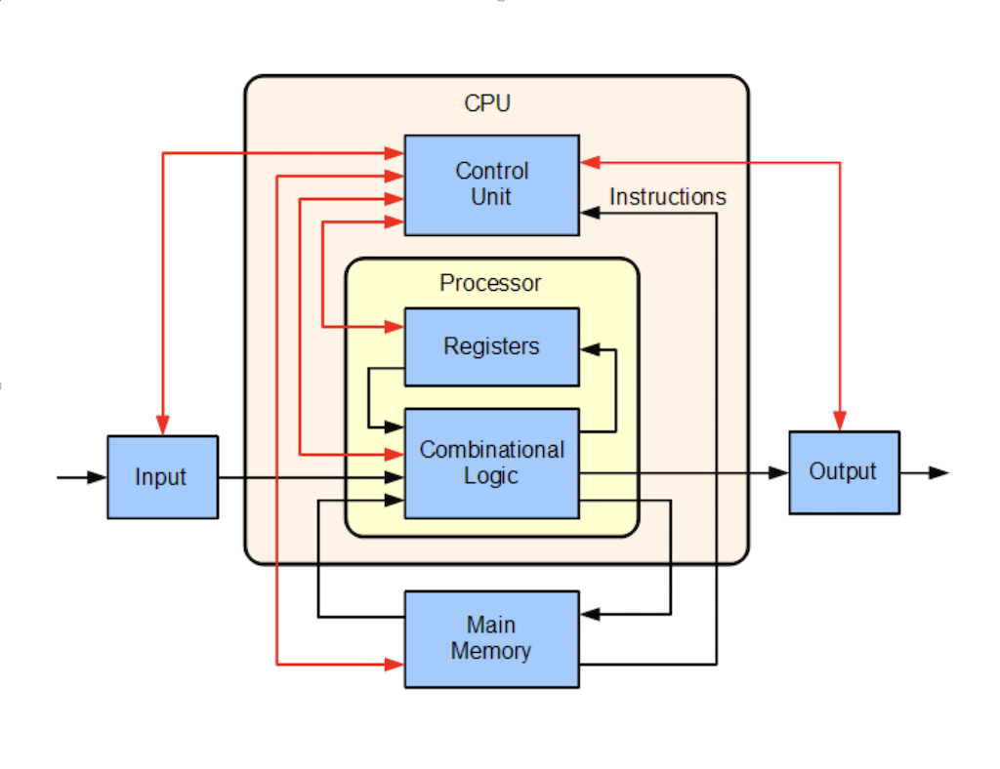

class: middle, center, title-slide
background-image: url("images/justblackbutwhy.png")
background-size: cover

#<br><br>HDAT9800 Health Data Visualisation & Communication<br><br>
## Accessing databases with `dplyr` 
#### Tim Churches and Data Carpentry contributors<br>
#### UNSW Medicine & Data Carpentry
#### 28th Feb 2022


```{r setup, include=FALSE, purl=FALSE}

options(htmltools.dir.version = FALSE)
knitr::opts_chunk$set(fig.retina=2)

if (file.exists("data/portal-database.sqlite")) file.remove("data/portal-database.sqlite")

# First specify the packages of interest
packages = c("dplyr", "dbplyr", "RSQLite")

## Now load or install & load all
package.check <- lapply(
  packages,
  FUN = function(x) {
    if (!require(x, character.only = TRUE)) {
      install.packages(x, dependencies = TRUE)
      library(x, character.only = TRUE)
    }
  }
)

library(dbplyr)
library(RSQLite)
library(tidyverse)
library(kableExtra)
```

```{r xaringan-themer, include=FALSE, warning=FALSE}

library(xaringanthemer)
style_duo_accent(
  primary_color = "#000000",
  secondary_color = "#ffdc00",
  header_font_google = google_font("Rubik"),
  text_font_google   = google_font("Roboto", "300", "300i"),
  code_font_google   = google_font("Roboto Mono")
)
```

```{r xaringan-tile-view, echo=FALSE}
xaringanExtra::use_tile_view()
```

```{r xaringan-panelset, echo=FALSE}
xaringanExtra::use_panelset()
```

```{r xaringan-animate-css, echo=FALSE}
xaringanExtra::use_animate_css()
```

```{css, echo = FALSE}
# for changing font size in code blocks
.remark-slide-content {
  font-size: 28px;
  padding: 20px 80px 20px 80px;
}
.remark-code, .remark-inline-code {
  background: #f0f0f0;
}
.remark-code {
  font-size: 24px;
}
.huge .remark-code { /*Change made here*/
  font-size: 200% !important;
}
.smallcode .remark-code { /*Change made here*/
  font-size: 80% !important;
}
.tiny .remark-code { /*Change made here*/
  font-size: 66% !important;
}
```

```{r, purl=TRUE, echo=FALSE}
## SQL databases and R
```

---

# Why are we covering `dplyr` and databases?

- ability to manipulate data is a fundamental skill in data science
  - to format data for visualisations
  - to create data-driven communications
- databases not covered much elsewhere in the UNSW Health Data Science courses?
  - if there is interest, we can include extra material on working with big data in Week 10 of this course
  
---

# Learning Objectives

- revise the basics of computer architecture
  - why databases matter
- revise how `R` and `python` access data
  - versus `SAS` & `SPSS`
- types of databases
- access a pre-made SQL database from `R`
- run SQL queries in `R` using `RSQLite` and `dplyr`

---

# Learning Objectives, continued

- describe the lazy behaviour of `dplyr` on data stored in a database outside of `R`
- prototype queries and retrieve all final results
- create complex queries across one or multiple database tables
- create an SQLite database from existing .csv files

---



---


---

# (Main) Memory (RAM) versus storage (discs, network storage)

- main memory (RAM) is fast for the CPU to access but limited in size
  - although “limited” is relative, and most personal computers have 8 or 16 GB of RAM these days
- R (and python, and Stata and most other languages) work on data that is held in main memory
  - they can't directly access data stored on disc or on a network (including the internet)
  - some languages like SAS make it look like they work directly on datasets stored on disc
    - but behind the scenes, they still move data from disc or network storage into main memory, in chunks, to work on it

---

# Relative access speed

- data stored on discs is much slower for the CPU to access than data stored in main memory
  - but data on disc can be much, much larger
  - much "disc" storage these days is actaully SSD (solid state discs ie non-volatile memory chips)
    - this is very fast to access and does not involve spinning discs of rust
    - but still an order of magnitude (10x) slower than accessing data in main memory
- data on network storage such as file servers or internet pages of sites is even slower
  - can be hundreds or thousands time slower to access
    - latency vs bandwidth
  
---

# Databases

- two meanings"
  - "a collection of data"
  - a system for storing and retrieving data in a structured fashion
  - we are referring to the second meaning
    - we tend to use the terms "data set" (or dataset) or "data collection" to distinguish the first meaning of "database"
    
---

# Databases

- structured means of managing large amounts of data in storage ie on disc
  - yes, there are also in-memory databases used where speed is important and the data are smaller
- hierarchical databases (sort of obsolete, but JSON...)
- object databases (less popular now)
- graph databases
- SQL (relational databases)
- NoSQL databases

---

# Data bigger than main memory

- in courses, we often deal with small datasets that easily fit into your computer's
memory
- but in the real world, many datasets that are too large to load entirely into main memory (RAM)
- such data are often stored in databases
- connecting `R` (or `python` etc) to such databases allows you to retrieve only
the chunks needed for the current analysis
- even better, many large datasets are already available in public or private
databases
  - you can query them without having to download the data first.

---

# Database interfaces

- `R` (and `python`) can connect to almost any existing database type
  - most common database types have `R` (or `python` ) packages  that allow you to connect to them (e.g., **`RSQLite`**, RMySQL, etc)
- the `dplyr` package can be extended with the [`dbplyr`](https://cran.r-project.org/package=dbplyr) package to interface `dplyr` with many widely-used databases types
  - including [sqlite](https://sqlite.org/), [mysql](https://www.mysql.com/) and [postgresql](https://www.postgresql.org/) and Microsoft SQL Server etc
  - as well as Google’s [bigquery](https://cloud.google.com/bigquery/), and other cloud databases (eg on AWS)

---

# `dplyr` talks SQL to databases

- interfacing with databases using `dplyr` involves on retrieving from a connected database  by generating `SELECT` SQL statements, but it doesn't modify the
database itself
  - `dplyr` does not offer functions to `UPDATE` or `DELETE` data in SQL databases
  - if you need these functionalities, you will need to use additional `R`
packages (e.g., `RSQLite`) to work more directly with the database
- in this tutorial we will demonstrate how to interact with a database using `dplyr`, using both the `dplyr`'s verb syntax and the database SQL syntax

---

# Where is my data?

- it can get a bit confusing!
  - you need to keep track of which data you are dealing with -- is it in the database or is it in main memory?
  - you need to develop a mental model of where it is stored
  
---

# The portal_mammals database

- we will use a pre-prepared SQLite database  contained in a single file `portal_mammals.sqlite`
- SQLite is an **in-process** SQL database system
  - it is a true SQL database, and data are stored on disc in an `.sqlite` file
  - but the database server code runs in the same `process` as the `R` (or `python`) code that calls it
  - this means that only a single process can access it at one time, but it is very easy to set up
  - most database systems use a separate server, which may be running on a different computer, or in a different process on the same computer, but which runs independently of the processes which are accessing it

- first you need to download the database file into a `data/` subdirectory using this code:

```{r download, eval = TRUE, purl=FALSE}
dir.create("data", showWarnings = FALSE)
download.file(url = "https://ndownloader.figshare.com/files/2292171",
              destfile = "data/portal_mammals.sqlite", mode = "wb")
```

---

# Install packages

- you also need to install `R` packages by running this code at the `R` console prompt (or use the package installation tab in RStudio)

```{r install-packages, eval=FALSE, echo=TRUE}

install.packages(c("dbplyr", "RSQLite", dependencies = TRUE)

```

---

# Connecting to databases

We can connect `R` to this database using:

```{r connect, purl=TRUE}
library(dplyr)
library(dbplyr)
mammals <- DBI::dbConnect(RSQLite::SQLite(), "data/portal_mammals.sqlite")
```

- the above code uses 2 packages that helps `dbplyr` and `dplyr` talk to the
SQLite database. 
  - `DBI` is not something that you'll use directly as a user. It allows R to send commands to databases irrespective of the database management system used. 
  - the `RSQLite` package allows `R` to interface with SQLite databases.
- note that these functions **do not** load the data into the `R` session (as the
`read_csv()` function would for data in a CSV file)
- instead, they merely instruct `R` to connect to the `SQLite` database contained in the `portal_mammals.sqlite` file
- using a similar approach, you could connect to many other database management systems that are supported by R including MySQL, PostgreSQL, BigQuery, etc.

---

# Inspect that database

Let's take a closer look at the `mammals` database we just connected to:

```{r tables, results="markup"}
src_dbi(mammals)
```

Just like a spreadsheet with multiple worksheets, a SQLite database can contain multiple tables. In this case three of them are listed in the `tbls` row in the output above:

* plots
* species
* surveys

Now that we know we can connect to the database, let's explore how to get the data from its tables into R.

---

# Querying the database with the SQL syntax

To connect to tables within a database, you can use the `tbl()` function from `dplyr`. This function can be used to send SQL queries to the database. To demonstrate this functionality, let's select the columns "year", "species_id", and "plot_id" from the `surveys` table:

```{r use-sql-syntax, purl=TRUE}
tbl(mammals, sql("SELECT year, species_id, plot_id FROM surveys"))
```

With this approach you can use any SQL SELECT query that the database supports.

---

# Querying the database with `dplyr` syntax

One of the strengths of `dplyr` is that the same operation can be done using `dplyr`'s verbs instead of writing SQL. First, we select the table on which to do the operations by creating the `surveys` object, and then we use the standard `dplyr` syntax as if it were a data frame:

```{r use-dplyr-syntax}
surveys <- tbl(mammals, "surveys")
surveys %>%
    select(year, species_id, plot_id)
```

---

# "Mapped" database tables

In this case, the `surveys` object behaves like a data frame -- we say they are "mapped" to a virtial data frame. Several functions that can be used with data frames can also be used on tables from a database. For instance, the `head()` function can be used to check the first 10 rows of the table:

```{r table_details, results='show', purl=FALSE}
head(surveys, n = 10)
```

This output of the `head` command looks just like a regular `data.frame`: The table has 9 columns and the `head()` command shows us the first 10 rows.

Note that the columns `plot_type`, `taxa`, `genus`, and `species` are missing. These are now located in the tables `plots` and `species` which we will join together in a moment.

---

# "Mapped" database tables

However, some functions don't work quite as expected. For instance, let's check how many rows there are in total using `nrow()`:

```{r nrows, results='show', purl=FALSE}
nrow(surveys)
```

That's strange! `R` doesn't know how many rows the `surveys` table contains - it returns `NA` instead. You might have already noticed that the first line of the `head()` output included `??` indicating that the number of rows wasn't known.

The reason for this behavior highlights a key difference between using `dplyr` on datasets in memory (e.g. loaded into your R session via `read_csv()`) and those provided by a database. To understand it, we take a closer look at how `dplyr` communicates with our SQLite database.

---

# SQL translation

Relational databases typically use a special-purpose language, [Structured Query Language (SQL)](https://en.wikipedia.org/wiki/SQL), to manage and query data.

For example, the following SQL query returns the first 10 rows from the `surveys` table:

```sql
SELECT *
FROM `surveys`
LIMIT 10
```

Behind the scenes, **`dplyr`**:

1. translates your R code into SQL
2. submits it to the database
3. translates the database's response into an R data frame

---

# SQL translation

To lift the curtain, we can use `dplyr`'s `show_query()` function to show which SQL commands are actually sent to the database:

```{r show_query, message=TRUE, purl=FALSE}
show_query(head(surveys, n = 10))
```

The output shows the actual SQL query sent to the database; it matches our manually constructed `SELECT` statement above.

Instead of having to formulate the SQL query ourselves - and having to mentally switch back and forth between `R` and `SQL` syntax - we can delegate this translation to `dplyr`. (You don't even need to know SQL to interact with a database via `dplyr`!)

---

# Who does the work?

`dplyr`, in turn, doesn't do the real work of subsetting the table, either. Instead, it merely sends the query to the database, waits for its response and returns it to us.

That way, `R` never gets to see the full `surveys` table - and that's why it could not tell us how many rows it contains. On the bright side, this allows us to work with large datasets - even too large to fit into our computer's memory.

`dplyr` can translate many different query types into SQL allowing us to, e.g., `select()` specific columns, `filter()` rows, or join tables.

To see this in action, let's compose a few queries with `dplyr`.

---

# Simple database queries

First, let's only request rows of the `surveys` table in which `weight` is less than 5 and keep only the species_id, sex, and weight columns.

```{r pipe, results='show', purl=FALSE}
surveys %>%
  filter(weight < 5) %>%
  select(species_id, sex, weight)
```

Executing this command will return a table with 10 rows and the requested `species_id`, `sex` and `weight` columns. Great!

... but wait, why are there only 10 rows?

The last line:

```
# ... with more rows
```

indicates that there are more results that fit our filtering criterion. Why was R lazy and only retrieved 10 of them?

---

# Laziness

Hadley Wickham, the author of `dplyr` [explains](https://cran.r-project.org/web/packages/dbplyr/vignettes/dbplyr.html):

> When working with databases, `dplyr` tries to be as lazy as possible:
>
> * It never pulls data into R unless you explicitly ask for it.
> * It delays doing any work until the last possible moment - it collects together
> everything you want to do and then sends it to the database in one step.

When you construct a `dplyr` query, you can connect multiple verbs into a single pipeline. For example, we combined the `filter()` and `select()` verbs using the `%>%` pipe.

---

# Laziness

If we wanted to, we could add on even more steps, e.g. remove the `sex` column in an additional `select` call:

```{r pipe2, results='show', purl=FALSE}
data_subset <- surveys %>%
  filter(weight < 5) %>%
  select(species_id, sex, weight)

data_subset %>%
  select(-sex)
```

Just like the first `select(species_id, sex, weight)` call, the `select(-sex)`
command is not executed by R. It is sent to the database instead. Only the
_final_ result is retrieved and displayed to you.

---

# Laziness

Of course, we could always add on more steps, e.g., we could filter by `species_id` or  minimum `weight`. That's why R doesn't retrieve the full set of results - instead it only retrieves the first 10 results from the database by default. (After all, you might want to add an additional step and get the
database to do more work...)

To instruct R to stop being lazy, e.g. to retrieve all of the query results from the database, we add the `collect()` command to our pipe. It indicates that our database query is finished: time to get the _final_ results and load them into the R session.

```{r collect, results='markup', purl=FALSE}
data_subset <- surveys %>%
  filter(weight < 5) %>%
  select(species_id, sex, weight) %>%
  collect()
```

Now we have all 17 rows that match our query in a `data.frame` and can continue
to work with them exclusively in R, without communicating with the database.

---

# Complex database queries

`dplyr` enables database queries across one or multiple database tables, using
the same single- and multiple-table verbs you encountered in the `dplyr` tutorial. This means
you can use the same commands regardless of whether you interact with a remote
database or local dataset! 

This is a really useful feature if you work with
large datasets: you can first prototype your code on a small subset that fits
into memory, and when your code is ready, you can change the input dataset to
your full database without having to change the syntax.

On the other hand, being able to use SQL queries directly can be useful if your
collaborators have already put together complex queries to prepare the dataset
that you need for your analysis.

---

# Complex database queries

To illustrate how to use `dplyr` with such more complex queries, we are going to join
the `plots` and `surveys` tables. The `plots` table in the database contains
information about the different plots surveyed by the researchers. To access it,
we point the `tbl()` command to it:

```{r plots, results='markup', purl=FALSE}
plots <- tbl(mammals, "plots")
plots
```

The `plot_id` column also features in the `surveys` table:

```{r surveys, results='markup', purl=FALSE}
surveys
```

Because `plot_id` is listed in both tables, we can use it to look up matching
records, and join the two tables.

---

# Joins

If we have two tables named `x` and `y` with a common column called "ID", we can join them using 'join' functions, two of which are described and illustrated below.

1. `inner_join()` : This returns all rows from `x` where there are matching values in `y`, and all columns from `x` and `y`.

2. `left_join()` : This return all rows from `x`, and all columns from `x` and `y`. Rows in `x` with no match in `y` will have `NA` values in the new columns.  

In both forms of join, if there are multiple matches between `x` and `y`, all combinations of the matches are returned. For the full list of 'join' functions, check out the [tidyverse join page.](https://dplyr.tidyverse.org/reference/mutate-joins.html)

---

# Joins 

In our example, the two tables we want to join are 'plots' and 'surveys'.


---

# Joins 

For example, to extract all surveys for the first plot, which has `plot_id` 1, we can do:

```{r join, results='markup', purl=FALSE}
plots %>%
  filter(plot_id == 1) %>%
  inner_join(surveys) %>%
  collect()
```

**Important Note:** Without the `collect()` statement, only the first 10
matching rows are returned. By adding `collect()`, the full set of 1,985 is
retrieved.

---

# Challenge 1

All these challenges are optional and are not marked.

> Write a query that returns the number of rodents observed in each plot in
> each year.
>
> Hint: Connect to the species table and write a query that joins the species
> and survey tables together to exclude all non-rodents.
> The query should return counts of rodents by year.
>
> Optional: Write a query in SQL that will produce the same result. You can join
> multiple tables together using the following syntax where foreign key refers
> to your unique id (e.g., `species_id`):
>
> SELECT table.col, table.col
> FROM table1 JOIN table2
> ON table1.key = table2.key
> JOIN table3 ON table2.key = table3.key


---


Don't look at the answers on the next slide yet!


---


> ## with dplyr syntax
> species <- tbl(mammals, "species")
>
> left_join(surveys, species) %>%
>   filter(taxa == "Rodent") %>%
>   group_by(taxa, year, plot_id) %>%
>   tally() %>%
>   collect()


> ## with SQL syntax
> query <- paste("
> SELECT a.year, b.taxa,count(*) as count
> FROM surveys a
> JOIN species b
> ON a.species_id = b.species_id
> AND b.taxa = 'Rodent'
> GROUP BY b.taxa, a.year, a.plot_id",
> sep = "" )
>
> tbl(mammals, sql(query))

---

# Challenge 2

> Write a query that returns the number of rodents observed in each
> plot in each year.

>  Hint: Connect to the species table and write a query that joins
>  the species and survey tables together to exclude all
>  non-rodents. The query should return counts of rodents by year.

> Optional: Write a query in SQL that will produce the same
> result. You can join multiple tables together using the following
> syntax where foreign key refers to your unique id (e.g.,
> `species_id`):

> SELECT table.col, table.col
> FROM table1 JOIN table2
> ON table1.key = table2.key
> JOIN table3 ON table2.key = table3.key

---

# Challenge 4

>  Write a query that returns the total number of rodents in each genus caught
>  in the different plot types.
>
>  Hint: Write a query that joins the species, plot, and survey tables together.
>  The query should return counts of genus by plot type.

---

# Enough (for now)!

We'll discuss answers to these challenges next week.
