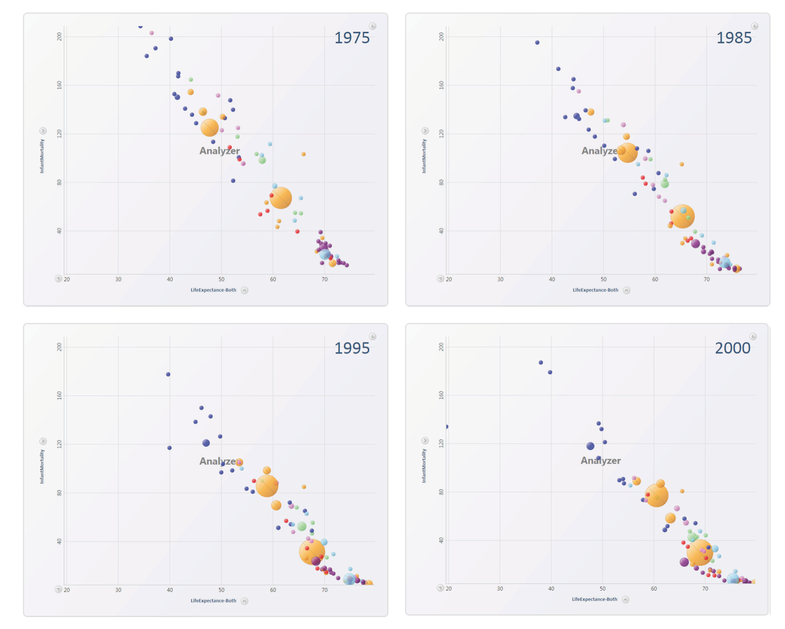
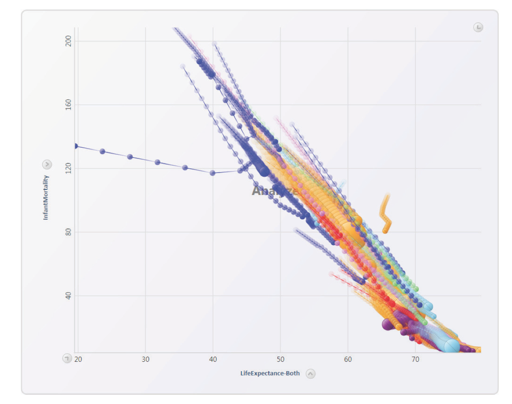
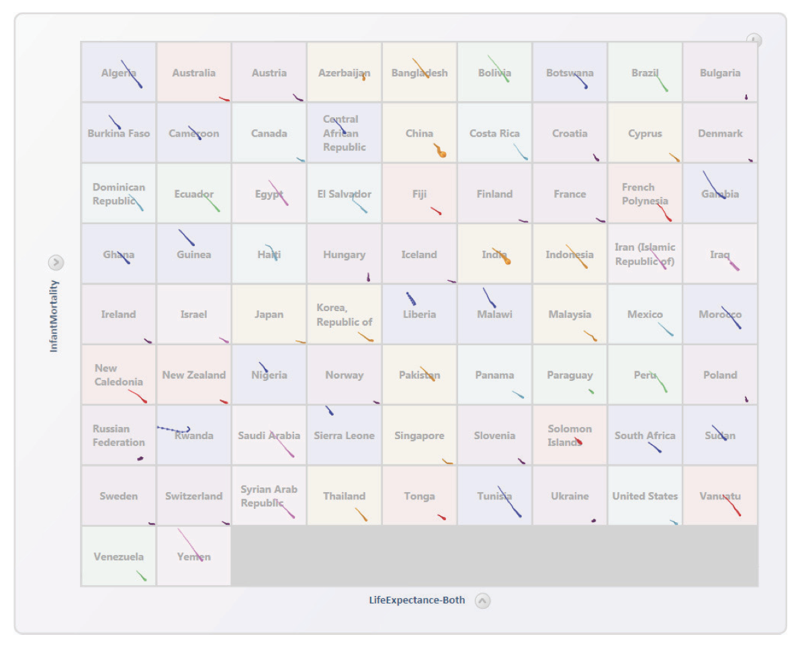

```{r setup, include=FALSE}
knitr::opts_chunk$set(echo = TRUE)
```

```{r klippy, echo=FALSE, include=TRUE}
klippy::klippy(position = c('top', 'right'))
```

## Overview

In this tutorial, we will look at animation in data visualisation. The first part considers data animation in general, from a theoretical point-of-view, and the second part covers how to implement these ideas using R, _ggplot2_ and a wonderful add-on package for it, _gganimate_.

Unless otherwise specified, the material for the first part of this tutorial has been adapted from:

> Danyel Fisher. Animation for Visualization: Opportunities and Drawbacks. in: Beautiful Visualization. Ch 19. O'Reilly Media, 2010. Complete book avaialble at [http://oreilly.com/catalog/0636920000617/](http://oreilly.com/catalog/0636920000617/)

## The key question

The key question to ask oneself when considering animation in data visualisation is:

> Does animation help build richer, more vivid, and more understandable visualisations, or does it simply confuse things?

The intuition behind animation seems clear enough: if a two-dimensional image is good, then a moving image should be better.


---

Movement is familiar -- we are accustomed to both moving through the real world and seeing things in it move smoothly. All around us, items move, grow, and change colour in ways that we understand deeply and richly.

In a visualisation, animation might help a viewer to:

* work through the logic behind an idea by showing the intermediate steps and transitions
* show how data collected over time changes

---

An animation might also smooth the change between two views of the data, even if there is no temporal component to the data or the change.

This is the _PowerPoint_ slide transition use of animation...

---

Animation can be a powerful technique when used appropriately, but it can be very bad when used poorly. 

Some animations can enhance the appeal of the visualisation being presented, but may make exploration of the dataset more difficult; other animated visualisations may facilitate exploration.

We will try to work out a framework for designing effective animated visualisations, starting with a brief review of some background material. Then we will dissect one of the most well-known animated visualisations, Hans Rosling’s GapMinder. Finally we'll look at some successes and failures with animation.

---

## Principles of animation

Any animation entails showing a viewer a series of images in rapid succession. 

The viewer assembles these images in their visual cortex and elsewhere in the brain, trying to build a coherent idea of what occurred between them. 

The viewer's perceptual system notes the changes between frames, and thus an animation can be understood as a series of visual changes between frames. 

When there are a small number of changes, it is quite simple to understand what has happened, and the viewer can trace the changes easily. 

When there are a large number of changes, it becomes more complex.

---

### Gesalt theory

At this point, we will introduce some ideas from [_Gesalt_ psychology](https://en.wikipedia.org/wiki/Gestalt_psychology). _Gestalt_ is a school of psychology that emerged in the early twentieth century in Austria and Germany as a theory of perception that asserted that organisms (including humans) perceive entire patterns or configurations, not merely individual components, often summed up by the adage "_the whole is more than the sum of its parts._"

The _Gestalt_ perceptual principle of **common fate** states that viewers will group large numbers of objects together, mentally labelling them all as a group, if they are travelling in the same direction and at the same speed. 

Individual objects that take their own trajectories will be seen as isolates, and will visually stand out. 

If all the items move in different directions, however, observers have far more difficulty following them. Perception researchers have shown that viewers have difficulty tracking more than four or five objects independently -- the eye (and/or the brain) gives up, tracking only a few objects and mentally labeling all the other movement as noise.

---

### Real versus abstract spaces

Animation tends to be used a lot for the display of scientific and engineering data that represents real-world spaces, such as animal movements across a landscape, or airflow over an aircraft wing. The animation adds the dimension of time.

Here is a superb example, created using R and the rayshader package for it: [https://twitter.com/S_Lisovski/status/1361039948892286979](https://twitter.com/S_Lisovski/status/1361039948892286979)

---

It is less used for more abstract data visualisations, in which we are abstractly mapping quantities or categories that do not have a nature relationship to three dimensional space.

---

### Borrowing from cartoons

Cartoons (and movies) depend on some of the same physical principles as computer animation, and thus it is worth considering  whether cartooning techniques might bring useful insights to the creation of animated visualisations. In 1946 the Belgian psychologist Albert Michotte noted the “perception of causality”: it is easy to believe that the movement in an animation shows intent: 

* that a point is chasing another across the screen (rather than moving in an equivalent trajectory one second behind it)
* that a ball hit another (rather than “this dot stopped at point A, and this other dot moved from A to B”)

Thus, we tend to ascribe agency and causality where none really exists.

In cartoons, of course, we wish to communicate causality. Traditional cartoonists have described how they endow drawn shapes with the “illusion of life”, using a barrage of techniques that are not completely true to life: 

* **squash and stretch** distorts objects during movement to draw the eye toward the direction of motion: objects might stretch when they fly at their fastest, and squashing them conveys a notion of stopping, gathering energy, or changing direction.
* **moving items along arcs** implies a more natural motion; motion along a straight line seems to have intent. 
* before objects begin moving, they anticipate their upcoming motion, and they conclude with a follow-through: **ease-in, ease-out** is a technique of timing animations: animations start slowly to emphasise direction, accelerate through the middle, and slow down again at the end.
* complex acts are **staged** to draw attention to individual parts one at a time.

Some of these technique may be useful for data visualisation, but they need to be used deliberately and with good reason, not gratuitously.

We don't what to imply intent or causality where none exists, nor do we want to convey emotional overlays to the data where these are not appropriate. 

---

## Some problems with animation

Two meta-analyses have looked at different types of animations -- process animations and algorithm visualisations -- and found that both classes have rather poor track records when it comes to helping students learn more about complex processes.

Tversky _et al._ (Tversky, Morrison, and Bétrancourt 2002) found, somewhat to their surprise, that animation did not seem to be helpful for process visualisation (ie visualisations that show how to use a tool or how a technique works). They reviewed nearly 100 studies of animation and visualisation -- in no study was animation found to outperform rich static diagrams. Animations did do better than textual representations, as well as simple representations that simply showed the start and end states without transitions.

Hundhausen _et al._ (2002) did a meta-analysis of the effectiveness of algorithm visualisation in secondary and tertiary education, but half of the controlled studies they examined found that animation did not help students understand algorithms.

The strongest factor predicting success was the theory behind the animation. Visualisation was most helpful when accompanied by constructivist approaches to education -- that is, when students manipulated code or algorithms and watched a visualisation that resulted from or illustrated their own work; or when students were asked questions and tried to use the visualisation to answer them. 

In contrast, animations were ineffective at transferring knowledge passively -- just watching an animation was not more effective than other forms of teaching.

Thus, always consider whether a sequence of static figues, such as facetted "small multiples" at time points, would be better than, or just as good as a true animation.

---

## GapMinder and Hans Rosling

Let's first watch a classic Hans Rosling presenation. Apologies for the poor resolution, this was from 2006 and the best I could find.

Just watch the first 10 minutes of this video on your own computer, then we will continue.

[https://www.ted.com/talks/hans_rosling_the_best_stats_you_ve_ever_seen](https://www.ted.com/talks/hans_rosling_the_best_stats_you_ve_ever_seen)


---

### Rosling deconstructed

So let's deconstruct his classic animated bubble chart of life expectancy versus fertility.

It's just a scatter plot, with x- and y-axis values representing fertility (number of children per woman) and life expactancy, with the points, one for each country, shown as dots (or bubbles) whose size is proportional to the total population of that country.

Rosling first shows single frames -- the statistics of the countries in a single year -- before starting to trace their progress through time, animating between the images with yearly steps in between.

It is totally compelling. Why?

He narrates the bubbles’ movements, describing their relative progress. China puts public health programs in place and its bubble floats upward, followed by other countries trying the same strategy. Another country’s economy booms, and its dot starts to move rapidly rightward. Rosling uses this animation to make powerful points about both our preconceptions about public health problems and the differences between the first and third world, and the animation helps viewers follow the points he is making.

---

### But so many bubbles...

Perceptual psychology research has shown  that people have trouble tracking more than four moving points at a time. 

In his presentation, Rosling is able to guide the audience, showing them where to look, and his narration helps them see which points to focus on. He describes the progress that a nation is making with the assistance of his arms and a long pointer stick --  it is quite clear where to look. This reduces confusion.

It also helps that many of the two-dimensional scatter plots he uses have unambiguously “good” and “bad” directions: it is good for a country to move toward lower birth rates and a longer life expectancy (ie, to go up and to the left), and bad to move in the opposite direction (down and to the right).

With Rosling’s sure hand guiding the watcher’s gaze, the animated visualisation is very effective. But if we presented the viewer with just the animated visualisation, without the "sportscaster" narrative,  would it be as useful for people who were trying to understand the data?

This question was tested by Microsoft in the early 2000s. They compared a Rosling-style animated bubble plot (without narration) with three alternatives:







They tested 30 different combinations of (x, y) values based on public health and demographic data from the United Nations, and presented users with fairly simple questions such as “In this scatter plot, which country rises the most in GDP?” and “In this scatter plot, which continent has the most countries with diminishing marriage rates?” 

They tested users who were familiar with scatter plots, and who dealt with data in their daily work. Some subjects got to explore the data, and sat in front of a computer answering questions on their own. Others got a presentation, in which they were shown the visualisation. They measured both time and accuracy as the subjects then answered the questions. The study’s results are detailed in Robertson _et al_. (2008). 

The major conclusions, however, can be stated quite simply: animation is both slower and less accurate at conveying the information than the other modalities.

---

### Exploration with animation is slower

Robertson _et al._ found that when users explored the data on their own, they would often play through the animation dozens of times, checking to see which country would be the correct answer to the question. 

In contrast, those who viewed a presentation and could not control the animation on their own answered far more rapidly: they were forced to choose an answer and go with it. Thus, animation in exploration was the slowest of the conditions, while animation in presentation was the fastest. But it was also clear that users wanted to move forward and backwards through time, under their own control.

---

### Animation is less accurate

Despite the extra time the users spent with the animation, the users who were shown the static visualisations were always more accurate at answering the questions. 

That is, the animation appeared to detract from the users’ ability to correctly answer questions. Their accuracy was not correlated with speed: the extra time they spent in exploration did not seem to drive better outcomes.

This seems like bad news for animation: it was slower and less accurate at communicating the information

---

### Animation can be more engaging

It's not all bad news for animation: Robertson _et al._ found that the animation was more engaging and emotionally powerful: one subject saw life expectancy in a war-torn country plummet by 30 years and gasped audibly. 

Generally, users preferred to work with the animation, finding it more enjoyable and exciting than the other modes. They also found it more frustrating, though: “Where did that dot go?” asked one subject angrily, as a data point that had been steadily rising suddenly dropped.

---

### So why was Hans Rosling so successful?

Clearly Rosling’s success is not just due to his use of animated visualisations. 

Critically, Rosling knows what the answer is: he has worked through the data, knows the rhetorical point he wishes to make, and he is bringing the viewers along for the ride. 

He runs much of his presentation on the same set of axes, so the viewers don’t get disoriented. 

His data are reasonably simple: few of the countries he highlights make major reversals in their trends, and when he animates many countries at once, they stay in a fairly close pack, travelling in the same direction. 

He chooses his axes so the countries move in consistent directions, allowing users to track origins and goals easily.

He takes advantage of the _Gestalt_ principle of **common fate** to group them, and he narrates their transitions for maximum clarity.

---

## Presentation is not exploration

A health data scientist looking at a new data set for the first time does not know what the data will show, and needs to play with it from different angles, looking for correlations, connections, and ideas that might be concealed in the data -- in other words, Tukey's idea of a thorough exploratory data analysis.

The process is one of foraging -- it involves rapidly reviewing various views of the data (as tables, summary statistics or plots) to see whether there is something interesting to investigate, followed by moving on with a new filter or a different view.

---

By contrast, presenters are experts in their own data. 

They have already cleaned errors from the dataset, perhaps removing a couple of outliers or they have highlighted data points that support the core ideas they want to communicate (hopefully without too much bias!).

They have picked axes and a time range that illustrate their point well, and they can guide the viewers’ perception of the data.

Most importantly, they are less likely to need to scrub back and forth,  in order to check whether they have overlooked a previous point. 

In these conditions, animation makes a lot of sense: it allows the presenter to explain a point vividly and dramatically.

Thus, the experience of exploration is different from the experience of presentation. 

---

It is easy to forget this, because many of the tools available to us (such as R and ggplot2 etc) mix the two together.

|                     | **Exploration**                      | **Presentation**                     |
|---------------------|--------------------------------------|--------------------------------------|
| **Characteristics** | Data are surprising                  | Data are well known to the presenter |
|                     | Data may be dirty and have outliers  | Data has been cleaned                |
|                     | Data is likely to move unpredictably |                                      |
|                     | Viewer controls interaction          | Viewer is passive                    |

|                      | **Exploration**                      | **Presentation**                                |
|----------------------|--------------------------------------|-------------------------------------------------|
| **Gaols/procedures** | Analyse multiple dimensions at once  | Present fewer dimensions to make a point        |
|                      | Change mappings many times           | Keep mappings steady                            |
|                      | Look for trends and anomalies        | Highlight critical points                       |
|                      |                                      | Group points together to show trends and motion |

---

## Some general principles for animated data visualisations

* **Compatibility**
  * Choose a visualisation that is compatible with the animation you have in mind.
* ** Coordinate motion**
  * Motion should occur in a meaningful coordinate space of the visualisation. We want to help the users stay oriented within the visualisation during the animation, so they can better predict and follow motion.
* **Meaningful motion**
  * Although animation is about moving items, unnecessary motion can be very confusing. In general, it is better to have fewer things move than more in a given transition.
  
## A taxonomy of animations

There are many sorts of change that might occur within a visualisation. The following is a list adapted from one assembled by Heer and Robertson (2007). 

Each type of transition is independent; it should be possible to change just the one element without changing any of the others. Many of these are applicable to both presentation and exploration of data:

* **Change the view**
  * Pan over or zoom in on a fixed image, such as a map or a large data space.
* **Change the charting surface**
  * On a plot, change the axes (eg change from linear to log scale).
* **Filter the data**
  * Remove data points from the current view according to a particular selection criterion.
* **Reorder the data**
  * Change the order of points (eg sort by a variable of interest).
* **Change the representation**
  * Change from a bar chart to a mosaic chart; change the layout of a graph; change the colors of nodes.
* **Change the data**
  * Move data forward through a time step, modify the data, or change the values portrayed
  
These six types of transitions can describe most animations that might be made with data visualisations.

---

Process visualisations would have a somewhat different taxonomy, as would scientific visualisations that convey flow (such as air over wings). 

Given this set of transitions, we'll think about how these animations might be managed.

---

### Some heuristics (rules of thumb) for managing transitions in animations

* **Do one thing at a time**
  * Ensure that the visualisation does not entail making multiple simultaneous changes. This might mean staging the visualisation, to ensure that each successive step is completed before the next one is started.
* **Preserve valid mappings**
  * At any given time during a step, ensure that the visualisation presents a valid mapping from data to visualisation. It would be invalid, for example, to rename the bars of a bar chart: the fundamental mapping is that each bar represents one x-axis value.
* **Maintain the invariant**
  * While the previous rule referred to the relationship between data elements and their presentation, this rule refers to the relationship of the data values to the animated visualisation. If the data values are not changing, the animation should maintain those invariant values throughout. For example, if each bar’s height is proportionate to the respective data point’s value, the bars should remain the same height during the animation.

## Recap: some basic principles of data animation

* **Staging**
  * It is disorienting to have too many things happen at once. If possible, change just one thing at a time. On the other hand, sometimes multiple changes need to happen at once; if so, they can be staged.
* **Compatibility**
  * A visualisation that will be disrupted by animation will be difficult for users to track. For example, it is not disruptive to add another bar to a bar chart (the whole set can slide over), and it may not be disruptive to add another series to a bar chart. However, a squarified treemap is laid out greedily by size; growing a single rectangle will require every rectangle to move to a new location and will look confusing.
* **Necessary motion**
  * In particular, avoid unnecessary motion. This implies that we want to ensure that motion is significant -- ie we should animate only what changes. In general, the image should always be understandable. Excess motion -- even if it is significant motion -- can be confusing.
* **Meaningful motion**
  * The coordinate spaces and types of motion should remain meaningful. This also entails two points discussed earlier: **preserve valid mappings** and **maintain the invariant**.

---

## To animate or not to animate: that is the question?

So you may be staring at a visualisation you’re working on, trying to decide whether to animate it or not. The key question to consider is: what function would the animation serve? If it is meant to allow a user to smoothly transition between views, then it is likely to be helpful. On the other hand, if the user is meant to compare the “before” to the “after,” the animation is less likely to be of use.

Users want to understand why a change is happening, and what is changing. If everything on the screen is going to move around, perhaps it would be better to simply switch atomically to a new image; this might spare the user the difficulty of trying to track the differences.

Finally, animations mean that it can be more difficult to print out visualizations. This is becoming less important, given that animations can be viewed on smartphones and tablets, which are ubiquitous. Nonetheless,  individual frames should be meaningful, so that users can capture and share those images, or share the essence of teh animation as a GIF file. Animation imposes a burden of complexity on the user, and that complexity should pay off.

---

### References

Michotte, A. 1963. The Perception of Causality. Oxford: Basic Books.

Hundhausen, Christopher D., Sarah A. Douglas, and John T. Stasko. 2002. “A meta- study of algorithm visualization effectiveness.” Journal of Visual Languages & Computing 13, no. 3: 259–290.

Robertson, George, Roland Fernandez, Danyel Fisher, Bongshin Lee, and John Stasko. 2008. “Effectiveness of animation in trend visualization.” IEEE Transactions on Visualization and Computer Graphics 14, no. 6: 1325–1332.

Tversky, Barbara, Julie B. Morrison, and Mireille Bétrancourt. 2002. “Animation: Can it facilitate?” International Journal of Human-Computer Studies 57: 247–262.


---

## Practical animation using _gganimate_

See the [_gganimate_ web site](https://gganimate.com/index.html) for full details.

`gganimate` extends the grammar of graphics as implemented by `ggplot2` to include the description of animation. It does this by providing a range of new grammar classes that can be added to the plot object in order to customise how it should change with time.

* `transition_*()` defines how the data should be spread out and how it relates to itself across time.
* `view_*()` defines how the positional scales should change along the animation.
* `shadow_*()` defines how data from other points in time should be presented in the given point in time.
* `enter_*()/exit_*()` defines how new data should appear and how old data should disappear during the course of the animation.
* `ease_aes()` defines how different aesthetics should be eased during transitions.

### Installation

Install ``gganimate` from CRAN in the usual way. Also install the `gapminder` package, containing the data Hans Rosling used.

### A first example

Run this code:

```{r, echo=TRUE, eval=FALSE}
library(ggplot2)
library(gganimate)

ggplot(mtcars, aes(factor(cyl), mpg)) + 
  geom_boxplot() + 
  # Here comes the gganimate code
  transition_states(
    gear,
    transition_length = 2,
    state_length = 1
  ) +
  enter_fade() + 
  exit_shrink() +
  ease_aes('sine-in-out')
```

### Another example

Run this code:

```{r, echo=TRUE, eval=FALSE}
library(gapminder)

ggplot(gapminder, aes(gdpPercap, lifeExp, size = pop, colour = country)) +
  geom_point(alpha = 0.7, show.legend = FALSE) +
  scale_colour_manual(values = country_colors) +
  scale_size(range = c(2, 12)) +
  scale_x_log10() +
  facet_wrap(~continent) +
  # Here comes the gganimate specific bits
  labs(title = 'Year: {frame_time}', x = 'GDP per capita', y = 'life expectancy') +
  transition_time(year) +
  ease_aes('linear')
```

## Step-by-step

```{r, echo=TRUE, eval=FALSE}

library(gganimate)

# We'll start with a static plot
p <- ggplot(iris, aes(x = Petal.Width, y = Petal.Length)) + 
  geom_point()

plot(p)
```

You go from a static plot made with `ggplot2` to an animated one, simply by adding on functions from `gganimate`.

```{r, echo=TRUE, eval=FALSE}

anim <- p + 
  transition_states(Species,
                    transition_length = 2,
                    state_length = 1)

anim
```

> ❗ transition_states() splits up plot data by a discrete variable and animates between the different states.

As can be seen, very few additions to the plot results in a quite complex animation. So what did we do to get this animation? 

We added a type of transition. Transitions are functions that interpret the plot data in order to somehow distribute it over a number of frames. `transition_states()` specifically splits the data into subsets based on a variable in the data (here `Species`), and calculates intermediary data states that ensures a smooth transition between the states (something referred to as _tweening_). `gganimate` provides a range of different transitions, but for the rest of the examples we’ll be sticking to `transition_states()` and see how we can modify the output.

### Easing

When `transition_states()` calculates intermediary data for the tweening, it needs to decide how the change from one value to another should progress. This is a concept called easing. The default easing is linear, but others can be used, potentially only targeting specific aesthetics. Setting easing is done with the `ease_aes()` function. The first argument sets the default easing and subsequent named arguments sets it for specific aesthetics.

```{r, echo=TRUE, eval=FALSE}

anim + 
  ease_aes('cubic-in-out') # Slow start and end for a smoother look
```

> ❗ e`ase_aes() `defines the velocity with which aesthetics change during an animation.

```{r, echo=TRUE, eval=FALSE}
anim + 
  ease_aes(y = 'bounce-out') # Sets special ease for y aesthetic
```

### Labelling

It can be quite hard to understand an animation without any indication as to what each time point relates to. `gganimate` solves this by providing a set of variables for each frame, which can be inserted into plot labels using _glue_ syntax.

```{r, echo=TRUE, eval=FALSE}
anim + 
  ggtitle('Now showing {closest_state}',
          subtitle = 'Frame {frame} of {nframes}')
```

> ❗ Use glue syntax to insert frame variables in plot labels and titles.

Different transitions provide different frame variables. `closest_state` only makes sense for `transition_states()` and is thus only available when that transition is used.

### Object Permanence

In the last animation, it appears as if data in a single measurement changes gradually as the flower being measured on somehow morphs between three different iris species. This is probably not how Fisher conducted the experiment and got those numbers. In general, when you make an animation, graphic elements should only transition between instances of the same underlying phenomenon. 

This sounds complicated but it is more or less the same principle that governs makes sense to draw a line between two observations. You wouldn’t connect observations from different iris species, but repeated observations on the same plant would be fine to connect. Same thing with animations.

Just to make this very clear (it is an important concept). The static line plot equivalent of our animation above is:

```{r, echo=TRUE, eval=FALSE}
ggplot(iris, aes(x = Petal.Width, y = Petal.Length)) + 
  geom_line(aes(group = rep(1:50, 3)), colour = 'grey') + 
  geom_point()
```

Yuck!

So, how do we fix this and tell `gganimate` to not morph observations from different species into each others? The key is the _group aesthetic_. You are familiar with this aesthetic from plotting lines and polygons, but in `gganimate` it takes a more central place. Data that have the same group aesthetic are interpreted as being linked across states. 

The semantics of the group aesthetic in `ggplot2` is such that if it is undefined it will get calculated based on the interaction of all discrete aesthetics (sans label). If none exists, such as in our iris animation, all data will get the same group, and will thus be matched by `gganimate`. So, there are two ways to fix our plot:

1. Add some aesthetics that distinguish the different species

```{r, echo=TRUE, eval=FALSE}
ggplot(iris, aes(x = Petal.Width, y = Petal.Length)) + 
  geom_point(aes(colour = Species)) + 
  transition_states(Species,
                    transition_length = 2,
                    state_length = 1)
```

2. Set the group directly

```{r, echo=TRUE, eval=FALSE}
ggplot(iris, aes(x = Petal.Width, y = Petal.Length)) + 
  geom_point(aes(group = seq_along(Species))) + 
  transition_states(Species,
                    transition_length = 2,
                    state_length = 1)
```

> ❗ The group aesthetic defines how the data in a layer is matched across the animation.

In general the second method  is preferred as it makes the intent explicit. It also makes it possible to match data with different discrete aesthetics such as keeping our (now obviously faulty) transition while having different colour for the different species):

```{r, echo=FALSE, eval=TRUE, include=FALSE}
library(ggplot2)
library(gganimate)
```

```{r, echo=TRUE, eval=TRUE}
ggplot(iris, aes(x = Petal.Width, y = Petal.Length)) + 
  geom_point(aes(colour = Species, group = 1L)) + 
  transition_states(Species,
                    transition_length = 2,
                    state_length = 1)
```

### Enter and Exit

While we may have made our animation more correct by separating the data from the different species, we have also made it quite a bit more boring. Now it simply appears as three static plots shown one at a time, which is hardly an attention grabber. If only there were a way to animate the appearance and disappearance of data…

Enter the **enter and exit** functions. These functions are responsible for modifying the state of appearing (entering) and disappearing (exiting) data, so that the animation can _tween_ from and to the new state. Let’s spice up our animation a bit:

```{r, echo=TRUE, eval=FALSE}
anim <- ggplot(iris, aes(x = Petal.Width, y = Petal.Length)) + 
  geom_point(aes(colour = Species), size = 2) + 
  transition_states(Species,
                    transition_length = 2,
                    state_length = 1)

anim + 
  enter_fade() + 
  exit_shrink()
```

> ❗ enter and exit functions are used to modify the aesthetics of appearing and disappearing data so that their entrance or exit may be animated.

`gganimate` comes with a range of different functions, and using the `enter_manual()` and `exit_manual()` functions you can create your own. Enter and exit functions are composable though, so you can often come pretty far by combining preexisting ones:

```{r, echo=TRUE, eval=FALSE}
anim + 
  enter_fade() + enter_drift(x_mod = -1) + 
  exit_shrink() + exit_drift(x_mod = 5)
```

### Rendering

In the examples so far the animations has simply appeared when we printed the animation object, just like we would expect from `ggplot2`. As a lot of things are happening automatically, and you might want to take control, this section will give a brief overview of the rendering.

`gganimate`’s model for an animation is dimensionless in the same way as `ggplot2` describe plots independent of the final width and height of the plot. This means that the final number of frames and its frame-rate are only ever given when you ask `gganimate` to render the animation. When you print an animation object the `animate()` function is called on the animation with default arguments, some of which are:

* **nframes** sets the number of frames (defaults to 100)
* **fps** sets the number of frames (defaults to 10)
* **dev** sets the device used to render each frame (defaults to 'png')
* **renderer** sets the function used to combine each frame into an animate (defaults to `gifski_renderer()`)

There are other arguments as well (eg ... will be passed on to the device so you can set width, height, dpi, etc), but those above are the most important. If you don’t like the defaults you can either call `animate()` directly with values of your choosing, or modify the defaults by setting new with `options(gganimate.<argument> = <value>)`.

A topic that requires some additional words are the renderers. The default will use `gifski` to combine the frames into a gif. gifs are great because they are virtually supported everywhere, and `gifski` is both a very fast, and very high quality converter. 

Still, you may have reasons to want a different output. `gganimate` is quite agnostic to how you want to combine the frames and, while it comes with a set of predefined renderers, any function that takes a vector of paths to image files along with a frame-rate, will do. 
The return value of your renderer is what is ultimately returned by the `animate()` function.

Below are a couple of examples of different `animate()` calls:

```{r, echo=TRUE, eval=FALSE}
# Video output
animate(
  anim + enter_fade() + exit_fly(y_loc = 1),
  renderer = av_renderer()
)
```

```{r, echo=TRUE, eval=FALSE}
# Different size and resolution
animate(
  anim + ease_aes(x = 'bounce-out') + enter_fly(x_loc = -1) + exit_fade(),
  width = 400, height = 600, res = 35
)
```

If you need to save the animation for later use you can use the `anim_save()` function. It works much like `ggsave()` from `ggplot2` and automatically grabs the last rendered animation if you do not specify one directly.

## More

See the _gganimate_ web site for full documentation, and there are many great examples on the web to learn from.

