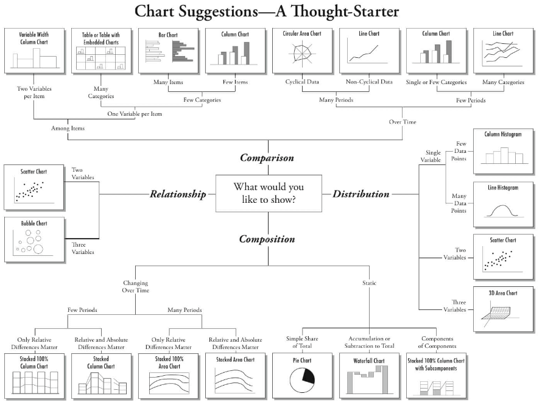

{width="75%"}

```{r setup, include=FALSE, echo=FALSE, message=FALSE, warning=FALSE}
## required packages not installed during tutorial package installation,
# libs <- c("")
# missing <- !libs %in% installed.packages()
# if (any(missing)) {
#   install.packages(libs[missing],repos="https://cloud.r-project.org", dependencies = TRUE)
# }

library(learnr)
library(ggplot2)
library(dplyr)
library(shiny)
library(knitr)
library(vcd)
library(vcdExtra)
library(forcats)
library(ggpubr)
library(FactoMineR)
library(factoextra)
library(datasets)

knitr::opts_chunk$set(echo = FALSE)

data(Arthritis, package="vcd")
data(DaytonSurvey, package="vcdExtra")

arthritis_txt <- read.delim(here::here("Chapter-7-categorical/extdata/arthritis.txt"))

```

```{r server-setup, context="server"}
# do not use - it interferes with the learnr "Start over" functionality
# session$onSessionEnded(stopApp)

```


## Selecting the correct chart

### Credits

Full credit is assigned to the [vcd-tutorial](https://cran.r-project.org/web/packages/vcdExtra/vignettes/vcd-tutorial.pdf).

A more general treatment of graphical methods for categorical data is contained in the book, Discrete Data Analysis with R: Visualizing and Modeling Techniques for Categorical and Count Data [Friendly and Meyer 2016]. Discrete Data Analysis with R: Visualization and Modeling Techniques for Categorical and Count Data. Chapman & Hall CRC, Boca Raton, FL. ISBN 978-1-4987-2583-5.

Due credit is given to [Tatvic](https://www.tatvic.com/blog/7-visualizations-learn-r/) and [Visualizing a Categorical Variable](https://homepage.divms.uiowa.edu/~luke/classes/STAT4580/catone.html) for the basis of content in \'Selecting the Right Chart Type\' and \'Data structures\'.


### Chart purpose

There are four basic presentation types

* Comparison
* Composition
* Distribution
* Relationship


To determine which amongst these is best suited, ask the questions

* How many variables do you want to show in a single chart
* How many data points will you display for each variable
* Will you display values over a period of time, or among items or groups

Below is a great infographic on [selecting the (or a) correct chart type](https://extremepresentation.typepad.com/blog/2006/09/choosing_a_good.html) by Dr. Andrew Abela.


{width="75%"}


## Categorical data structures


### Forms of categorical data

Categorical data can be

* nominal, qualitative
* ordinal


For visualisation, the main difference is that ordinal data suggests a particular display order.
Purely categorical data can come in a range of formats. The most common are

* raw data (also referred to as unit record data or microdata) _i.e._ individual observations
* aggregated data\: counts for each unique combination of levels
* cross tabulated data


Working With Categorical Variables

Categorical variables are usually represented as

* character vectors
* factors


Some advantages of factors

* more control over ordering of levels
* levels are preserved when forming subsets
  * even if there are no rows containing a particular factor value, the fact that there _could have been_ rows with that value is preserved when the factor data type is used.


Most plotting and modelling functions will convert character vectors to factors with levels ordered alphabetically.
Some standard R functions for working with factors include

* `factor` creates a factor from another type of variable
* `levels` returns the levels of a factor
* `reorder` changes level order to match another variable
* `relevel` moves a particular level to the first position as a base line
* `droplevels` removes levels not in the variable


The tidyverse package `forcats` adds some more tools, including

* `fct_inorder` creates a factor with levels ordered by first appearance
* `fct_infreq` orders levels by decreasing frequency
* `fct_rev` reverses the levels
* `fct_recode` changes factor levels
* `fct_relevel` moves one or more levels
* `fct_c merges` two or more factors


## Data structures

The first thing you need to know is that categorical data can be represented in three different
forms in R, and it is sometimes necessary to convert from one form to another, for carrying out
statistical tests, fitting models or visualising the results. Once a data object exists in R, you can
examine its complete structure with the `str()` function, or view the names of its components with
the `names()` function.

`HairEyeColor` from the inbuilt `datsets` package contains data for a survey of individuals, recording hair color, eye color, and gender of 592 individuals.  It is stored in cross tablulated (table) form. Thus

```{r hec, echo=TRUE, exercise=TRUE, exercise.setup="", fig.width=8, fig.height=8, output.width="90%"}
HairEyeColor

```

A little more exploration

```{r hec-explore, echo=TRUE, exercise=TRUE, exercise.setup="", fig.width=8, fig.height=8, output.width="90%"}
str(HairEyeColor)
sum(HairEyeColor) # number of cases
sapply(dimnames(HairEyeColor), length) # table dimension sizes

```


### Raw (unit record) Data

Use `expand.dft()` from `vcd` package to transform to raw (unit record) data format

```{r hec-expand, echo=TRUE, exercise=TRUE, exercise.setup="", fig.width=8, fig.height=8, output.width="90%"}
raw_hec <- expand.dft(HairEyeColor)
head(raw_hec)

```


### Aggregated Data

One way to aggregate raw categorical data is to use `count` from `dplyr`

```{r hec-setup, include=FALSE, echo=FALSE, message=FALSE, warning=FALSE}
raw_hec <- expand.dft(HairEyeColor)
```

```{r aggregate_count, echo=TRUE, exercise=TRUE, exercise.setup="hec-setup", fig.width=8, fig.height=8, output.width="90%"}
agg_count <- raw_hec %>% count(Hair, Eye, Sex)
head(agg_count)

```

The `count_` function from `dplyr` allows the variables for use to be read from the data

```{r count_aggregate, echo=TRUE, exercise=TRUE, exercise.setup="hec-setup", fig.width=8, fig.height=8, output.width="90%"}
count_agg <- raw_hec %>% count_(names(raw_hec))
head(count_agg)

```

However `count_()` is deprecated since `dplyr` v0.7, so now we should do something like this instead:

```{r count_across_aggregate, echo=TRUE, exercise=TRUE, exercise.setup="hec-setup", fig.width=8, fig.height=8, output.width="90%"}
count_agg <- raw_hec %>% count(across(everything()))
head(count_agg)

```


### Cross-Tabulated Data

Cross-tabulated data can be produced from aggregate data using `xtabs()`

```{r agg_setup, include=FALSE, echo=FALSE, message=FALSE, warning=FALSE}
raw_hec <- expand.dft(HairEyeColor)
count_agg <- raw_hec %>% count(across(everything()))
```

```{r xtab-agg, echo=TRUE, exercise=TRUE, exercise.setup="agg_setup", fig.width=8, fig.height=8, output.width="90%"}
raw_hec <- expand.dft(HairEyeColor)
count_agg <- raw_hec %>% count(across(everything()))
xtabs(n ~ Hair + Eye + Sex, data = count_agg)

```

Cross-tabulated data can be produced from raw (unit record) data using `table()`

```{r xtab-raw, echo=TRUE, exercise=TRUE, exercise.setup="hec-setup", fig.width=8, fig.height=8, output.width="90%"}
xtb <- table(raw_hec)
xtb

```


* Both raw (unit record) and aggregate data in this example are in tidy form, the cross tabulated date is not.
* The cross-tabulated data can be converted to the tidy aggregate form using `as.data.frame`

```{r xtab-setup, include=FALSE, echo=FALSE, message=FALSE, warning=FALSE}
raw_hec <- expand.dft(HairEyeColor)
xtb <- table(raw_hec)
```

```{r xtab-tidy, echo=TRUE, exercise=TRUE, exercise.setup="xtab-setup", fig.width=8, fig.height=8, output.width="90%"}
raw_hec <- expand.dft(HairEyeColor)
xtb <- table(raw_hec)
class(xtb)
xtb_df <- as.data.frame(xtb)
class(xtb_df)
head(xtb_df)

```


### Raw data, unit record data, case form, microdata

All of these are synonyms for a data frame containing individual observations, with one or more factors, used as the classifying variables. There may also be numeric covariates. The total number
of observations is `nrow(X)`, and the number of variables is `ncol(X)`.

The `Arthritis` data is available in raw data form in the `vcd` package. There are two
explanatory factors, `Treatment` and `Sex`. `Age` is a numeric covariate, and `Improved` is the
response, an ordered factor, with levels None \< Some \< Marked. Excluding `ID` and `Age`, we would
have a 2 × 2 × 3 contingency table for `Treatment`, `Sex` and `Improved`.

```{r case-form, echo=TRUE, exercise=TRUE, exercise.setup="", fig.width=8, fig.height=8, output.width="90%", warning=FALSE, message=FALSE}
names(Arthritis)
str(Arthritis)
head(Arthritis,5)

```


### Frequency form

* a.k.a. Aggregated form

a data frame containing one or more factors, and a frequency variable, often
called `Freq` or `count` or `n`. The total number of observations is `sum(X$Freq)`, `sum(X[,"Freq"])`
or some equivalent form. The number of cells in the table is `nrow(X)`.

```{r freq-form, echo=TRUE, exercise=TRUE, exercise.setup="", fig.width=8, fig.height=8, output.width="90%"}
arthritis_agg <- Arthritis %>% count(across(names(Arthritis)))
head(arthritis_agg)

```

Or dropping `ID` and `Age`

```{r freq-drop, echo=TRUE, exercise=TRUE, exercise.setup="", fig.width=8, fig.height=8, output.width="90%"}
arthritis_drop <- count(Arthritis, Treatment, Sex, Improved)
head(arthritis_drop)

```


### Table form

* a.k.a. Cross tabulated form

a matrix, array or table object, whose elements are the frequencies in an n-way table.
The variable names (factors) and their levels are given by `dimnames(X)`. The total number of
observations is `sum(X)`. The number of dimensions of the table is `length(dimnames(X))`, and
the table sizes are given by `sapply(dimnames(X), length)`.

For example, the `HairEyeColor` dataset in `vcd` is stored in table form.  Let us look at similar form for the `Arthritis` dataset, having already dropped `ID` and `Age`

```{r drop-setup, include=FALSE, echo=FALSE, message=FALSE, warning=FALSE}
arthritis_drop <- count(Arthritis, Treatment, Sex, Improved)
```

```{r table-form, echo=TRUE, exercise=TRUE, exercise.setup="drop-setup", fig.width=8, fig.height=8, output.width="90%"}
arthritis_drop <- count(Arthritis, Treatment, Sex, Improved)
xtabs(n ~ Treatment + Improved + Sex, data = arthritis_drop)

```


## Ordered factors and reordered tables

For the `HairEyeColor` data, hair color and eye color are ordered arbitrarily. For visualising the
data using mosaic plots and other methods described below, it turns out to be more useful to assure
that both hair color and eye color are ordered from dark to light. It is easiest to reorder by indexing. Again `str()` is your friend.

```{r re-order, echo=TRUE, exercise=TRUE, exercise.setup="hec-setup", fig.width=8, fig.height=8, output.width="90%"}
str(HairEyeColor)
HairEyeColor <- HairEyeColor[ , c(1,3,4,2), ]
str(HairEyeColor)

```

Let us start by plotting a bar chart of the `Hair` variable

```{r hair-arbit, echo=TRUE, exercise=TRUE, exercise.setup="hec-setup", fig.width=8, fig.height=8, output.width="90%"}
raw_hec %>% 
  ggplot() + geom_bar(aes(x = Hair))

```

For a nominal variable it is often better to order the bars by decreasing frequency. Now, reorder `Hair` using the `forcats` library

```{r hair-ordered, echo=TRUE, exercise=TRUE, exercise.setup="hec-setup", fig.width=8, fig.height=8, output.width="90%"}
raw_hec %>%
  mutate(Hair = fct_infreq(Hair)) %>%
    ggplot() +
      geom_bar(aes(x = Hair))

```

With data in case form or frequency form, when you have ordered factors represented with character values, you must ensure that they are treated as ordered in R.

Imagine that the Arthritis data was read from a text file. A suitable .txt file is given in the extdata folder and has been preloaded using

> arthritis_txt <- read.delim("Chapter-7-categorical/extdata/arthritis.txt")

```{r txt-ordered, echo=TRUE, exercise=TRUE, exercise.setup="", fig.width=8, fig.height=8, output.width="90%"}
str(arthritis_txt)

```

By default the `Improved` will be ordered alphabetically i.e. Marked, None, Some, or not at all. This is not what we want. In this case, the function ordered() (and others) can be useful.

```{r ordered, echo=TRUE, exercise=TRUE, exercise.setup="", fig.width=8, fig.height=8, output.width="90%"}
levels(arthritis_txt$Improved)

arthritis_txt$Improved <- ordered(arthritis_txt$Improved, levels=c("None", "Some", "Marked"))
levels(arthritis_txt$Improved)

```

With this order of `Improved`, the response in this data, a mosaic display of `Treatment` and
`Improved` shows a clearly interpretable pattern.

```{r mosiac-arthritis, echo=TRUE, exercise=TRUE, exercise.setup="", fig.width=8, fig.height=8, output.width="90%"}
arthritis_txt$Improved <- ordered(arthritis_txt$Improved, levels=c("None", "Some", "Marked"))
mosaic(~Treatment + Improved, data = arthritis_txt, gp = shading_max, 
       split_vertical = TRUE, main="Arthritis: [Treatment] [Improved]")

```

Finally, there are situations where, particularly for display purposes, you want to reorder
the dimensions of an n-way table, or change the labels for the variables or levels. This is easy
when the data are in table form. `aperm()` permutes the dimensions, and assigning to names and
dimnames changes variable names and level labels respectively.

```{r aperm-arthritis, echo=TRUE, exercise=TRUE, exercise.setup="", fig.width=8, fig.height=8, output.width="90%"}
ftable(HairEyeColor)

hec_mod <- aperm(HairEyeColor, c(3, 1, 2))
dimnames(hec_mod)[[1]] <- c("M", "F")
names(dimnames(hec_mod)) <- c("Gender", "HAIR", "Eyes")
ftable(hec_mod)

```


## Frequency tables

### table() and friends

You can generate frequency tables from factor variables using the `table()` function, tables of
proportions using the `prop.table()` function, and marginal frequencies using `margin.table()`.

```{r freq-table, echo=TRUE, exercise=TRUE, exercise.setup="", fig.width=8, fig.height=8, output.width="90%", warning=FALSE, message=FALSE}
set.seed(1010)
n=500
A <- factor(sample(c("a1","a2"), n, rep=TRUE))
B <- factor(sample(c("b1","b2"), n, rep=TRUE))
C <- factor(sample(c("c1","c2"), n, rep=TRUE))
mydata <- data.frame(A,B,C)
head(mydata)

# 2-Way Frequency Table
attach(mydata)
mytable <- table(A,B) # A will be rows, B will be columns
mytable # print table

margin.table(mytable, 1) # A frequencies (summed over B)
margin.table(mytable, 2) # B frequencies (summed over A)

prop.table(mytable) # cell percentages
prop.table(mytable, 1) # row percentages
prop.table(mytable, 2) # column percentages

```


`table()` can also generate multidimensional tables based on 3 or more categorical variables. In
this case, use the `ftable()` or `structable()` function to print the results more attractively.

```{r table-setup, include=FALSE, echo=FALSE, message=FALSE, warning=FALSE}
set.seed(1010)
n=500
A <- factor(sample(c("a1","a2"), n, rep=TRUE))
B <- factor(sample(c("b1","b2"), n, rep=TRUE))
C <- factor(sample(c("c1","c2"), n, rep=TRUE))
mydata <- data.frame(A,B,C)
```

```{r table-3way, echo=TRUE, exercise=TRUE, exercise.setup="table-setup", fig.width=8, fig.height=8, output.width="90%"}
# 3-Way Frequency Table
mytable <- table(A, B, C)
ftable(mytable)

```


`table()` ignores missing values by default. To include NA as a category in counts, include the
table option `exclude=NULL` if the variable is a vector. If the variable is a factor you have to create
a new factor using

```{r, eval=FALSE, echo=TRUE)
newfactor <- factor(oldfactor, exclude=NULL).
```


## xtabs()

The `xtabs()` function allows you to create crosstabulations of data using formula style input. This
typically works with case form data supplied in a data frame or a matrix. The result is a contingency
table in array format, whose dimensions are determined by the terms on the right side of the formula.

```{r xtabs, echo=TRUE, exercise=TRUE, exercise.setup="table-setup", fig.width=8, fig.height=8, output.width="90%"}
set.seed(1010)
n=500
A <- factor(sample(c("a1","a2"), n, rep=TRUE))
B <- factor(sample(c("b1","b2"), n, rep=TRUE))
C <- factor(sample(c("c1","c2"), n, rep=TRUE))
mydata <- data.frame(A,B,C)

# 3-Way Frequency Table
mytable <- xtabs(~A+B+C, data=mydata)
mytable
ftable(mytable) # print table
summary(mytable) # chi-square test of indepedence

```


If a variable is included on the left side of the formula, it is assumed to be a vector of frequencies
(useful if the data have already been tabulated in frequency form).

```{r xtabs-formula, echo=TRUE, exercise=TRUE, exercise.setup="", fig.width=8, fig.height=8, output.width="90%"}
head(GSS)
(GSStab <- xtabs(count ~ sex + party, data=GSS))

```


```{r xtabs-setup, include=FALSE, echo=FALSE, message=FALSE, warning=FALSE}
GSStab <- xtabs(count ~ sex + party, data=GSS)
```

```{r xtabs-out, echo=TRUE, exercise=TRUE, exercise.setup="xtabs-setup", fig.width=8, fig.height=8, output.width="90%"}
summary(GSStab)

```


## structable()
For 3-way and larger tables, the structable() function in `vcd` provides a convenient and flexible
tabular display. The variables assigned to the rows and columns of a two-way display can be
specified by a model formula.

```{r struct-table, echo=TRUE, exercise=TRUE, exercise.setup="", fig.width=8, fig.height=8, output.width="90%"}
structable(HairEyeColor) # show the table: default

```


```{r struct-colrows, echo=TRUE, exercise=TRUE, exercise.setup="", fig.width=8, fig.height=8, output.width="90%"}
structable(Hair+Sex ~ Eye, HairEyeColor) # specify col ~ row variables

```


It also returns an object of class `structable` which may be plotted with `mosaic()`

```{r struct-mosiac, echo=TRUE, exercise=TRUE, exercise.setup="", fig.width=8, fig.height=8, output.width="90%"}
HSE <- structable(Hair+Sex ~ Eye, HairEyeColor) # save structable object
mosaic(HSE) # plot it

```


## Collapsing over table factors
### aggregate(), margin.table() and apply()

It sometimes happens that we have a data set with more variables or factors than we want to
analyse, or else, having done some initial analyses, we decide that certain factors are not important,
and so should be excluded from graphic displays by collapsing (summing) over them. For example,
mosaic plots and fourfold displays are often simpler to construct from versions of the data collapsed
over the factors which are not shown in the plots.

The appropriate tools to use again depend on the form in which the data are represented, a
case-form data frame, a frequency form data frame (`aggregate()`), or a table form array or table
object (`margin.table()` or `apply()`).

When the data are in frequency form, and we want to produce another frequency data frame,
`aggregate()` is a handy tool, using the argument `FUN = sum` to sum the frequency variable over the
factors not mentioned in the formula.

The data frame `DaytonSurvey` in the `vcdExtra` package represents a table giving
the frequencies of reported use (`ever used?`) of alcohol, cigarettes and marijuana in a sample of
high school seniors, also classified by sex and race.

```{r dayton, echo=TRUE, exercise=TRUE, exercise.setup="", fig.width=8, fig.height=8, output.width="90%"}
str(DaytonSurvey)
head(DaytonSurvey)

```


To focus on the associations among the substances, we want to collapse over `sex` and `race`. The
right hand side of the formula used in the call to `aggregate()` gives the factors to be retained in
the new frequency data frame, `Dayton_ACM_df`.

```{r dayton-aggregate, echo=TRUE, exercise=TRUE, exercise.setup="", fig.width=8, fig.height=8, output.width="90%"}
# data in frequency form
# collapse over sex and race
Dayton_ACM_df <- aggregate(Freq ~ cigarette + alcohol + marijuana, data = DaytonSurvey, FUN = sum)
Dayton_ACM_df

```


When the data are in table form, and we want to produce another table, `apply()` with `FUN = sum`
can be used in a similar way to sum the table over dimensions not mentioned in the MARGIN argument.
`margin.table()` is just a wrapper for `apply()` using the `sum()` function.

### Example
To illustrate, we first convert the DaytonSurvey to a 5-way table using `xtabs()`,
giving `Dayton_tab`.

```{r xtabs-structable, echo=TRUE, exercise=TRUE, exercise.setup="", fig.width=8, fig.height=8, output.width="90%"}
# in table form
Dayton_tab <- xtabs(Freq ~ cigarette + alcohol + marijuana + sex+race, data = DaytonSurvey)
structable(cigarette + alcohol + marijuana ~ sex + race, data = Dayton_tab)

```


Then, use `apply()` on `Dayton_tab` to give the 3-way table `Dayton_ACM_tab` summed over sex and
race. The elements in this new table are the column sums for `Dayton_tab` shown by `structable()`
just above.

```{r apply-setup, include=FALSE, echo=FALSE, message=FALSE, warning=FALSE}
Dayton_tab <- xtabs(Freq~cigarette+alcohol+marijuana+sex+race, data=DaytonSurvey)
```

```{r xtabs-apply, echo=TRUE, exercise=TRUE, exercise.setup="apply-setup", fig.width=8, fig.height=8, output.width="90%"}
Dayton_tab <- xtabs(Freq ~ cigarette + alcohol + marijuana + sex+race, data = DaytonSurvey)
# collapse over sex and race
Dayton_ACM_tab <- apply(Dayton_tab, MARGIN = 1:3, FUN = sum)
Dayton_ACM_tab <- margin.table(Dayton_tab, 1:3) # same result
structable(cigarette + alcohol ~ marijuana, data = Dayton_ACM_tab)

```


## Collapsing table levels
### collapse.table()

A related problem arises when we have a table or array and for some purpose we want to reduce the
number of levels of some factors by summing subsets of the frequencies. For example, we may have
initially coded Age in 10 year intervals, and decide that, either for analysis or display purposes, we
want to reduce Age to 20 year intervals. The `collapse.table()` function in `vcdExtra` was designed
for this purpose.

### Example

Create a 3-way table, and collapse Age from 10 year to 20 year intervals. First, we
generate a 2 × 6 × 3 table of random counts from a Poisson distribution with mean of 100.

```{r collapse-levels, echo=TRUE, exercise=TRUE, exercise.setup="", fig.width=8, fig.height=8, output.width="90%"}
# create some sample data in frequency form
sex <- c("Male", "Female")
age <- c("10-19", "20-29", "30-39", "40-49", "50-59", "60-69")
education <- c("low", "med", "high")
eddata <- expand.grid(sex=sex, age=age, education=education)

set.seed(1010)
counts <- rpois(36, 100) # random Possion cell frequencies
eddata <- cbind(eddata, counts)

# make it into a 3-way table
t1 <- xtabs(counts ~ sex + age + education, data=eddata)
structable(t1)

```


Now collapse age to 20 year intervals, and education to 2 levels. In the arguments, levels of age
and education given the same label are summed in the resulting smaller table.

```{r age-setup, include=FALSE, echo=FALSE, message=FALSE, warning=FALSE}
sex <- c("Male", "Female")
age <- c("10-19", "20-29", "30-39", "40-49", "50-59", "60-69")
education <- c("low", "med", "high")
eddata <- expand.grid(sex=sex, age=age, education=education)
set.seed(1010)
counts <- rpois(36, 100) # random Possion cell frequencies
eddata <- cbind(eddata, counts)
t1 <- xtabs(counts ~ sex + age + education, data=eddata)
```

```{r age-20, echo=TRUE, exercise=TRUE, exercise.setup="age-setup", fig.width=8, fig.height=8, output.width="90%"}
sex <- c("Male", "Female")
age <- c("10-19", "20-29", "30-39", "40-49", "50-59", "60-69")
education <- c("low", "med", "high")
eddata <- expand.grid(sex=sex, age=age, education=education)
set.seed(1010)
counts <- rpois(36, 100) # random Possion cell frequencies
eddata <- cbind(eddata, counts)
t1 <- xtabs(counts ~ sex + age + education, data=eddata)

# collapse age to 3 levels, education to 2 levels
t2 <- collapse.table(t1, age=c("10-29", "10-29", "30-49", "30-49", "50-69", "50-69"), education=c("<high", "<high", "high"))
structable(t2)

```


## Converting among frequency tables and data frames

As we have seen, a given contingency table can be represented equivalently in different forms, but
some R functions were designed for one particular representation. The table below shows some handy tools
for converting from one form to another.

### Tools for converting among different forms for categorical data

 --              |                            To this                |||
 --------------- | ------------- | ---------------- | ---------------- |
**From this**    | *Case form*   | *Frequency form* | *Table form*     |
*Case form*      | noop          | xtabs(~A+B)      | table(A,B)       |
*Frequency form* | expand.dft(X) | noop             | xtabs(count~A+B) |
*Table form*     | expand.dft(X) | as.data.frame(X) | noop             |

A contingency table in table form (an object of class(table)) can be converted to a data.frame
with `as.data.frame()`.

The resulting `data.frame` contains columns representing the classifying
factors and the table entries (as a column named by the responseName argument, defaulting to
`Freq`. This is the inverse of `xtabs()`).

Convert the Arthritis data in case form to a 3-way table of Treatment × Sex ×
Improved. Note the use of `with()` to avoid having to use `Arthritis$Treatment` etc. within the
call to `table()`.

```{r arthritis-3way, echo=TRUE, exercise=TRUE, exercise.setup="", fig.width=8, fig.height=8, output.width="90%"}
Art_tab <- with(Arthritis, table(Treatment, Sex, Improved))
str(Art_tab)

```


```{r ftable-setup, include=FALSE, echo=FALSE, message=FALSE, warning=FALSE}
Art_tab <- with(Arthritis, table(Treatment, Sex, Improved))
```

```{r arthritis-ftable, echo=TRUE, exercise=TRUE, exercise.setup="ftable-setup", fig.width=8, fig.height=8, output.width="90%"}
Art_tab <- with(Arthritis, table(Treatment, Sex, Improved))
ftable(Art_tab)

```


There may also be times that you will need an equivalent case form `data.frame` with factors
representing the table variables rather than the frequency table. For example, the `mca()` function in
package `MASS` only operates on data in this format.

```{r arthritis-backtrans, echo=TRUE, exercise=TRUE, exercise.setup="ftable-setup", fig.width=8, fig.height=8, output.width="90%"}
Art_tab <- with(Arthritis, table(Treatment, Sex, Improved))
Art_df <- expand.dft(Art_tab) 
str(Art_df)
Art_df
```


## Fourfold plots
The UCBAdmissions data serves as an example of a 2 × 2 × 6 table, with Dept as the stratifying
variable.

```{r ucb, echo=TRUE, exercise=TRUE, exercise.setup="", fig.width=8, fig.height=8, output.width="90%"}
UCB <- aperm(UCBAdmissions, c(2, 1, 3))
dimnames(UCB)[[2]] <- c("Yes", "No")
names(dimnames(UCB)) <- c("Sex", "Admit?", "Department")
ftable(UCB)

```


```{r ucb-odds, echo=TRUE, exercise=TRUE, exercise.setup="", fig.width=8, fig.height=8, output.width="90%"}
oddsratio(UCBAdmissions, log=FALSE)

```


```{r ucb-odds2, echo=TRUE, exercise=TRUE, exercise.setup="", fig.width=8, fig.height=8, output.width="90%"}
lor <- oddsratio(UCBAdmissions) # capture log odds ratios
summary(lor)

```


```{r ucb-woolf, echo=TRUE, exercise=TRUE, exercise.setup="", fig.width=8, fig.height=8, output.width="90%"}
woolf_test(UCBAdmissions)

```


We can visualise the odds ratios of Admission for each department with fourfold displays using
`fourfold()`. The cell frequencies $n_{ij}$ of each 2 × 2 table are shown as a quarter circle whose radius
is proportional to $√n_{ij}$, so that its area is proportional to the cell frequency. Confidence rings for
the odds ratio allow a visual test of the null of no association. The rings for adjacent quadrants
overlap iff the observed counts are consistent with the null hypothesis. In the extended version
(the default), brighter colors are used where the odds ratio is significantly different from 1.

```{r four-setup, include=FALSE, echo=FALSE, message=FALSE, warning=FALSE}
UCB <- aperm(UCBAdmissions, c(2, 1, 3))
```

```{r four-fold, echo=TRUE, exercise=TRUE, exercise.setup="four-setup", fig.width=8, fig.height=8, output.width="90%"}
col <- c("#99CCFF", "#6699CC", "#F9AFAF", "#6666A0", "#FF0000", "#000080")
UCB <- aperm(UCBAdmissions, c(2, 1, 3))
fourfold(UCB, mfrow = c(2,3), color = col)

```


Fourfold display for the UCBAdmissions data. Where the odds ratio differs significantly
from 1.0, the confidence bands do not overlap, and the circle quadrants are shaded more intensely.

Another `vcd` function, `cotabplot()`, provides a more general approach to visualising conditional
associations in contingency tables, similar to trellis like plots produced by `coplot()` and lattice
graphics. The panel argument supplies a function used to render each conditional subtable. The
following gives a display similar to the fourfold example.

```{r cot, echo=TRUE, exercise=TRUE, exercise.setup="", fig.width=8, fig.height=8, output.width="90%"}
UCB <- aperm(UCBAdmissions, c(2, 1, 3))
cotabplot(UCB, panel = cotab_fourfold)

```


## Odds ratios

There is a `plot()` method for oddsratio objects. By default, it shows the 95%
confidence interval for the log odds ratio.

```{r odds-setup, include=FALSE, echo=FALSE, message=FALSE, warning=FALSE}
lor <- oddsratio(UCBAdmissions)
```

```{r odds-plot, echo=TRUE, exercise=TRUE, exercise.setup="odds-setup", fig.width=8, fig.height=8, output.width="90%"}
lor <- oddsratio(UCBAdmissions)
plot(lor, xlab = "Department", ylab = "Log Odds Ratio (Admit | Gender)")

```


Log odds ratio plot for the UCBAdmissions data


## Doubledecker plots

When we want to view the conditional probabilities of a response variable, e.g. `Admit`, in relation
to several factors, an alternative visualisation is a `doubledecker()` plot. This plot is a specialised version of a mosaic plot, which highlights the levels of a response variable, plotted vertically, in relation to the factors, shown horizontally. The following indexes on the first factor, `Admit`, to make `Admitted` the highlighted level. In this plot, the association between `Admit` and `Gender` is shown where the heights of the
highlighted conditional probabilities do not align. The excess of females admitted in Dept A stands
out here.

```{r doubledeck, echo=TRUE, exercise=TRUE, exercise.setup="", fig.width=8, fig.height=8, output.width="90%"}
doubledecker(Admit ~ Dept + Gender, data = UCBAdmissions[2:1,,])

```


Doubledecker display for the UCB Admissions data. The heights of the highlighted bars
show the conditional probabilities of Admit, given Dept and Gender.


## Changing the labels for variables and levels

With data in contingency table form or as a frequency data frame, it often happens that the variable
names and/or the level values of the factors, while suitable for analysis, are less than adequate when
used in mosaic plots and other `strucplot` displays.

For example, we might prefer that a variable named `ses` appear as `Socioeconomic Status`,
or a factor with levels `c("M", "F")` be labeled using `c("Male", "Female")` in a plot. Or, sometimes we start with a factor whose levels are fully spelled out (e.g. `c("strongly disagree", "disagree", "neutral", "agree", "strongly agree"))`, only to find that the level labels overlap in graphic displays.
The `structplot` framework in `vcd` provides an extremely large variety of functions and options
for controlling almost all details of text labels in mosaics and other plots. See `help(labelings)`
for an overview.

For example, we showed how to rearrange the dimensions of the UCBAdmissions
table, change the names of the table variables, and relabel the levels of one of the table variables.
The code below changes the actual table for plotting purposes, but we pointed out that these
changes can create other problems in analysis.

```{r mosiac-labels, echo=TRUE, exercise=TRUE, exercise.setup="", fig.width=8, fig.height=8, output.width="90%"}
UCB <- aperm(UCBAdmissions, c(2, 1, 3))
names(dimnames(UCB)) <- c("Sex", "Admit?", "Department")
dimnames(UCB)[[2]] <- c("Yes", "No")

```


The same effects can be achieved without modifying the data using the `set_varnames` and
`set_labels` options in `mosaic()` as follows

```{r labels-mod, echo=TRUE, exercise=TRUE, exercise.setup="", fig.width=8, fig.height=8, output.width="90%"}
vnames <- list(set_varnames = c(Admit="Admission", Gender="Sex", Dept="Department"))
lnames <- list(Admit = c("Yes", "No"),
Gender = c("Males", "Females"),
Dept = LETTERS[1:6])
mosaic(UCBAdmissions, labeling_args=vnames, set_labels=lnames)

```


## Mosaic plots

The essential idea is to recursively sub-divide a unit square into rectangular tiles for the cells
of the table, such that the are area of each tile is proportional to the cell frequency.

`mosaic()` provides a wide range of options for the directions of splitting, the specification of
shading, labeling, spacing, legend and many other details. It is actually implemented as a special
case of a more general class of displays for n-way tables called `strucplot`, including sieve diagrams,
association plots, double decker plots as well as mosaic plots. For details, see `help(strucplot)` and
the “See also” links, and also Meyer, Zeileis, and Hornik (2006), which is available as an R vignette
via `vignette("strucplot", package="vcd")`.

Let us look at the association between `Treatment` and `Improved` via the following call following call to `mosaic()`

```{r mosiac-max, echo=TRUE, exercise=TRUE, exercise.setup="", fig.width=8, fig.height=8, output.width="90%"}
mosaic(~Treatment + Improved, data = Arthritis, gp = shading_max, 
       split_vertical = TRUE, main="Arthritis: [Treatment] [Improved]")


```

Note that the residuals for the independence model were not large (as shown in the legend), yet the
association between `Treatment` and `Improved` is highly significant. In contrast, one of the other shading schemes, from Friendly (1994), use `gp = shading_Friendly`, uses fixed cutoffs of ±2, ±4, to shade cells which are individually significant at approximately α = 0.05 and α = 0.001 levels, respectively

```{r mosiac-friendly, echo=TRUE, exercise=TRUE, exercise.setup="", fig.width=8, fig.height=8, output.width="90%"}
mosaic(~Treatment + Improved, data = Arthritis, gp = shading_Friendly, 
       split_vertical = TRUE, main="Arthritis: [Treatment] [Improved]")

```


## Spine and conditional density plots

When continuous predictors are available, and potentially important, in explaining a categorical
outcome, we can use generalise linear models (GLMs) to investigate. Without going into fitting such 
models here, it would be remiss not to illustrate some visualisations
in `vcd` that are helpful here. The first of these is the spine plot or spinogram (Hummel 1996)
(produced with `spine()`). These are special cases of mosaic plots with specific spacing and shading
to show how a categorical response varies with a continuous or categorical predictor.

They are also a generalization of stacked bar plots where not the heights but the widths of the
bars corresponds to the relative frequencies of x. The heights of the bars then correspond to the
conditional relative frequencies of y in every x group.

For the Arthritis data, we can see how `Improved` varies with `Age` as follows.

`spine()` takes a formula of the form `y ~ x` with a single dependent factor and a single explanatory
variable x (a numeric variable or a factor). The range of a numeric variablex is divided into intervals
based on the breaks argument, and stacked bars are drawn to show the distribution of y as x varies.
As shown below, the discrete table that is visualised is returned by the function.

```{r spine, echo=TRUE, exercise=TRUE, exercise.setup="", fig.width=8, fig.height=8, output.width="90%"}
(spine(Improved ~ Age, data = Arthritis, breaks = 3))

```

Switching the `breaks` option

```{r spine-scott, echo=TRUE, exercise=TRUE, exercise.setup="", fig.width=8, fig.height=8, output.width="90%"}
(spine(Improved ~ Age, data = Arthritis, breaks = "Scott"))

```


The conditional density plot (Hofmann and Theus 2005) is a further generalisation. This visualisation technique is similar to spinograms, but uses a smoothing approach rather than discretising the explanatory variable. As well, it uses the original x axis and not a distorted one.

```{r cdplot-vcd, echo=TRUE, exercise=TRUE, exercise.setup="", fig.width=8, fig.height=8, output.width="90%"}
cd_plot(Improved ~ Age, data = Arthritis)

```

In such plots, it is useful to also see the distribution of the observations across the horizontal axis,
e.g. with a `rug()` plot.

`cd_plot()` is from the `vcd` package.  Similar results can be obtained by using `cdplot()` from the `graphics` package.  `cdplot()` also allows us to add a rug plot, thus

```{r cdplot-rug, echo=TRUE, exercise=TRUE, exercise.setup="", fig.width=8, fig.height=8, output.width="90%"}
cdplot(Improved ~ Age, data = Arthritis)
with(Arthritis, rug(jitter(Age), col="white", quiet=TRUE))

```

It can be easily seen that the proportion of patients reporting `Some` or `Marked`
improvement increases with `Age`, but there are some peculiar bumps in the distribution. These
may be real or artifactual, but they would be hard to see with most other visualization methods.
When we switch from non-parametric data exploration to parametric statistical models, such effects
are easily missed.


## Measures of Agreement

The `Kappa()` function in the `vcd` package calculates Cohen’s κ and weighted κ for a square two way
table with the same row and column categories (Cohen 1960). Normal theory z-tests are obtained
by dividing κ by its asymptotic standard error (ASE). A `confint()` method for Kappa objects
provides confidence intervals.

```{r kappa, echo=TRUE, exercise=TRUE, exercise.setup="", fig.width=8, fig.height=8, output.width="90%"}
(K <- Kappa(SexualFun))

```

```{r kappa-setup, include=FALSE, echo=FALSE, message=FALSE, warning=FALSE}
K <- Kappa(SexualFun)
```

```{r kappa-ci, echo=TRUE, exercise=TRUE, exercise.setup="kappa-setup", fig.width=8, fig.height=8, output.width="90%"}
confint(K)

```

A visualisation of agreement, both unweighted and weighted for degree of departure from exact
agreement is provided by the `agreementplot()` function. An agreementplot for the
SexualFun data is generated below. The Bangdiwala measures represent the proportion
of the shaded areas of the diagonal rectangles, using weights w1 for exact agreement, and w2 for
partial agreement one step from the main diagonal.

```{r agree-plot, echo=TRUE, exercise=TRUE, exercise.setup="", fig.width=8, fig.height=8, output.width="90%"}
agree <- agreementplot(SexualFun, main="Is sex fun?")
unlist(agree)

```

In other examples, the agreement plot can help to show sources of disagreement. For example,
when the shaded boxes are above or below the diagonal (red) line, a lack of exact agreement can
be attributed in part to different frequency of use of categories by the two raters lack of marginal
homogeneity.


## A few other thoughts & ideas

Credit for the basis of this section is duly given to [STHDA](http://www.sthda.com/english/articles/32-r-graphics-essentials/129-visualizing-multivariate-categorical-data/).


To visualise a small data set containing multiple categorical (or qualitative) variables, you can create either a bar plot, a balloon plot or a mosaic plot.

For a large multivariate categorical data, you need specialised statistical techniques dedicated to categorical data analysis, such as simple and multiple correspondence analysis. These methods make it possible to analyse and visualise the association, i.e. correlation, between a large number of qualitative variables.


### Bar plot

Demo data set, `HairEyeColor`, distribution of hair and eye color and sex in 592 statistics students

```{r hair-eye, echo=TRUE, exercise=TRUE, exercise.setup="", fig.width=8, fig.height=8, output.width="90%"}
data(HairEyeColor)
df <- as.data.frame(HairEyeColor)
head(df)

```

Create the bar graph

* Hair color on x axis
* Change bar fill by Eye color
* Split the graph into multiple panel by Sex

```{r bar-setup, include=FALSE, echo=FALSE, message=FALSE, warning=FALSE}
df <- as.data.frame(HairEyeColor)
```

```{r bar, echo=TRUE, exercise=TRUE, exercise.setup="bar-setup", fig.width=8, fig.height=8, output.width="90%"}
ggplot(df, aes(x = Hair, y = Freq))+
  geom_bar(
    aes(fill = Eye), stat = "identity", color = "white",
    position = position_dodge(0.9)
    )+
  facet_wrap(~Sex) + 
  fill_palette("jco")

```


### Balloon plot

Visualise a grouped frequency table. Create a multi panel plot by `Sex`

```{r balloon, echo=TRUE, exercise=TRUE, exercise.setup="", fig.width=8, fig.height=8, output.width="90%"}
df <- as.data.frame(HairEyeColor)
ggballoonplot(df, x = "Hair", y = "Eye", size = "Freq",
              fill = "Freq", facet.by = "Sex",
              ggtheme = theme_bw()) +
  scale_fill_viridis_c(option = "C")

```


### Mosaic plot

A mosaic plot is basically an area proportional visualisation of observed frequencies, composed of tiles (corresponding to the cells) created by recursive vertical and horizontal splits of a rectangle. The area of each tile is proportional to the corresponding cell entry, given the dimensions of previous splits.

Mosaic graph can be created using either the function `mosaicplot()` (in `graphics`) or the function `mosaic()` (in `vcd` package). Read more at Visualizing Multi-way Contingency Tables with vcd.

Example of mosaic plot

```{r hair-mosiac, echo=TRUE, exercise=TRUE, exercise.setup="", fig.width=8, fig.height=8, output.width="90%"}
mosaic(HairEyeColor, shade = TRUE, legend = TRUE)

```


### Correspondence analysis

Correspondence analysis can be used to summarise and visualise the information contained in a large contingency table formed by two categorical variables.

Required package `FactoMineR` for the analysis and `factoextra` for the visualisation

```{r correspondence, echo=TRUE, exercise=TRUE, exercise.setup="", fig.width=8, fig.height=8, output.width="90%"}
res_ca <- CA(housetasks, graph = FALSE)
fviz_ca_biplot(res_ca, repel = TRUE)

```

From the graphic above, it’s clear that

* Housetasks such as dinner, breakfeast, laundry are done more often by the wife
* Driving and repairs are done more frequently by the husband
