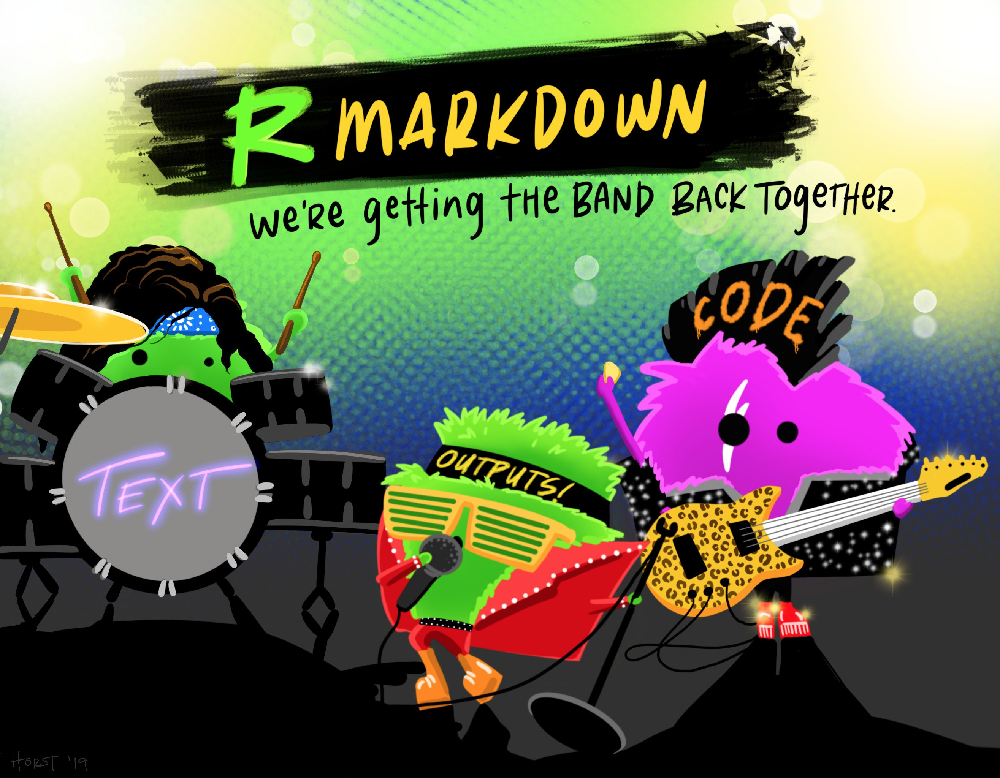

```{r setup, include=FALSE}
knitr::opts_chunk$set(echo = FALSE)

library(fontawesome)
library(knitr)
library(kableExtra)
library(dplyr)
library(hexSticker)
library(ggplot2)
library(shiny)
library(vembedr)

options(kableExtra.html.bsTable = T)

```

```{r course-logo, preview=TRUE}

```

Graphic by [Alison Horst](https://github.com/allisonhorst/stats-illustrations), used under CC-BY license.

# What's in the lectures and tutorials for this Chapter?

* Part 1
  * An overview of literate programming
  * Introduction to literate programming in the R ecosystem: R markdown and knitr
* Part 2
  * a quick look at some additional output formats for knitr

View the lecture videos (below), and download the lecture notes (available for Part A only, there is no slide deck for part B) if you want to follow along with the presenter (or for revision later). 

After you have viewed the lectures, please proceed to the tutorials.

There is also an interactive `learnr` tutorial covering literate programming using `knitr`. This covers much of the same material as the Part 1 lecture for Chapter 2, but goes into a bit more detail. 

Links and further instructions for each component are provided in the sections below.

# Pre-recorded lectures for Chapter 2

View the lecture videos below, and download the lecture notes if you want to follow along with the presenter (or for revision later). 

*  **Part 1**

```{r ch2-part1-video, preview=TRUE}
embed_url("https://youtu.be/S8L-1P_Xaoo")
```

[**Slide deck for Chapter 2 - Part 1**](assets/HDAT9800-2022-T2-Chapter-2-part-1.pdf)

* **Part 2**

```{r ch2-part2-video, preview=TRUE}
embed_url("https://youtu.be/j8dx_EIux9A")
```


**There is no slide deck for Part 2.***

After you have viewed the lectures, please proceed to do the related `knitr` tutorial (see below).


# `learnr` tutorial for Chapter 2

You should download and install the `hdat9800` tutorials package for `R` by following the instructions provided on the home page. Intructions for installing `R` and `RStudio` are provided [here](installing_r.html).

**Note*: Essentially the same tutorial is contained in the `cbdrhintro` tutorials package. However, you should do the one called "**Chapter 2: knitr**" because it is slightly more up-to-date. We will endeavour to fix this duplication of tutorials in the near future. However, it doesn't really matter which version of the `knitr` tutorial you do.

The tutorial is also available online via the link from the course schedule table on the course home page.

The tutorial covers much of the same material as in the pre-recorded lectures, but goes into a bit more detail. See below for suggested practical exercises to be undertaken after you have finished reviewing the tutorial.

If you have any questions about the lectures or tutorials, or if you want to share any useful resources or post insights, please post in the [Teams space](https://teams.microsoft.com/l/channel/19%3a7ce6b5565a284b51b0e85c20ad2bcc2a%40thread.tacv2/Chapter%25202?groupId=40f150b6-6fa9-478e-875f-cd02465b18a2&tenantId=3ff6cfa4-e715-48db-b8e1-0867b9f9fba3) for the course, in the channel for Chapter 2.

## Optional practical exercises (not assessed or marked)

## Part B (4 marks)

1. Use R (via RStudio) to create an R markdown presentation document. You can use any of the standard R markdown presentation types (ioslides, slidify or beamer) and the output format for each (ioslides and slidify are for an HTML slide deck, beamer creates PDF slide decks).

2. Give the presentation a title slide. 

3. Visit the R Graph Gallery web site at 
https://www.r-graph-gallery.com and choose three charts or plots from that site that you find interesting or potentially useful (you will not be marked on your choice of chart or plot from the, any will be OK). 

4. Take the code for each of the three charts or plots from the R Graph Gallery web site and insert it into three code chunks in your presentation. Each code chunk should be on a separate slide. Note that you should choose charts or plots for which the code runs without problem, although it is fine if it relies on additional R packages or on data that is automatically downloaded from a web site (most of the R code on the R Graph gallery web site meets this criterion, but a few don't -- avoid those).

5. After each chart, insert a new slide containing a brief discussion of why you like or value the chart, as a series of bullet points or equivalent point formatting. You will not be marked on teh quality of your discussion, so do not spend too much time on it, but it should at least make sense.

6. Add a conclusion and acknowledgements slide in which you attribute the code you used to the R Graph Gallery web site.

7. Test your slide deck file to ensure that it renders (knits) correctly and that the resulting slide deck displays correctly in your web browser or PDF viewer as appropriate.

8. Commit the Rmd file for the presentation to the assignmeent git repository and push the repository back to GitHub.

You can revise your assignment submissions at any time, and multiple times,  up to the assignment due date and time (see the course timetable on OpenLearning for when that is).

You are welcome to ask for guidance from the course instructors and/or fellow students if you encounter problems or if there is anything you would like to clarify. However, this is an individual assignment and what you submit must be your own work and not copied from anyone or anywhere else (except for the permitted re-use of R code from the R Graph Gallery web site as described above).


# Interactive sessions for Chapter 2

Details will appear here shortly.

# Chapter 2 assessment exercise

Details will appear here shortly.

# Readings and Resources for Chapter 2

```{r, eval=TRUE, include=TRUE}

reading = c(
      "Claus O. Wilke. Fundamentals of Data Visualization. Chapter 1 - Introduction",
      "Claus O. Wilke. Fundamentals of Data Visualization. Chapter 2 - Mapping data onto aesthetics",
      "RStudio Inc. Cheat Sheets (available directly in RStudio)",
      "Xie Y. 15 Tips on Making Better Use of R Markdown. RStudio, 2019. (Yihui Xie is the creator of knitr for R and has a great sense of humour...)",
      "Cullen B., Hill A., Velasquez I. R Markdown Lesser-Known Tips & Tricks #2: Cleaning Up Your Code. RStudio blog post, 6 Jan 2022.",
      "McNulty K. Ten awesome R Markdown tricks. Towards Data Science (blog),  9 Dec 2022."
    )

links <- c(
  "<a class='fa fa-globe' href='https://clauswilke.com/dataviz/introduction.html' target='_blank'></a>",
  "<a class='fa fa-globe' href='https://clauswilke.com/dataviz/aesthetic-mapping.html' target='_blank'></a>",
  "<a class='fa fa-file-pdf' href='https://rmarkdown.rstudio.com/lesson-15.HTML' target='_blank'></a>",
  "<a class='fa fa-globe' href='https://slides.yihui.org/2019-dahshu-rmarkdown#1' target='_blank'></a><br><a class='fa fa-youtube' href='https://www.youtube.com/watch?v=L5yTrtRdeCI' target='_blank'></a>",
  "<a class='fa fa-globe' href='https://www.rstudio.com/blog/r-markdown-tips-tricks-2-cleaning-up-your-code/' target='_blank'></a>",
  "<a class='fa fa-globe' href='https://towardsdatascience.com/ten-awesome-r-markdown-tricks-56ef6d41098' target='_blank'></a>"
)


df <- data.frame(
  reading = reading,
  links = links
)


kbl(df, escape = FALSE,
    align = c('l', 'c'),
    col.names = NULL) %>%
  kable_styling(bootstrap_options = "hover") %>% 
    kableExtra::group_rows(start_row = 1, end_row = 2, group_label = "Core readings")  %>% 
    kableExtra::group_rows(start_row = 3, end_row = 6, group_label = "Other resources") 

```

<aside>

<br>

You should prioritise the core readings each week.  

</aside>


