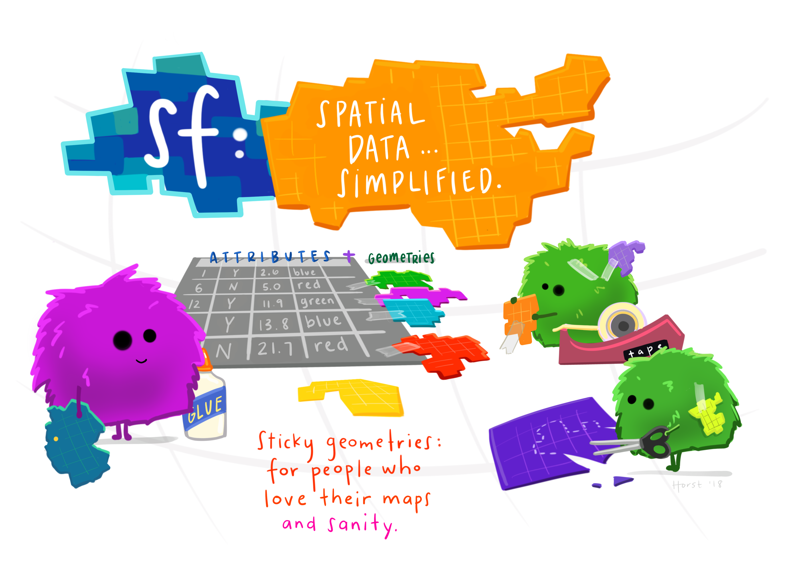

```{r setup, include=FALSE}
knitr::opts_chunk$set(echo = FALSE)

library(fontawesome)
library(knitr)
library(kableExtra)
library(dplyr)
library(hexSticker)
library(ggplot2)
library(shiny)
library(vembedr)

options(kableExtra.html.bsTable = T)

```

```{r course-logo, preview=TRUE}

```

Graphic by [Alison Horst](https://github.com/allisonhorst/stats-illustrations), used under CC-BY license.

# Introduction to the core curriculum content for this chapter (Dr James Farrow)

```{r intro-video, preview=TRUE}
embed_url("https://youtu.be/EAs9TSwoSGE")
```

# What's in the lectures and tutorials for this Chapter?

This chapter looks at visualising geographic data as maps. The pre-recorded lecture covers: 

* Leaflet (an open-source interactive mapping tool)
* Coordinate systems and mapping 
* Description of the Chapter 5 online tutorial 
* What's in Chapter 6 

After viewing the pre-recorded lecture below (the slide deck for it is available below the video), you should go through the interactive learnr tutorial for this chapter (see below). 

```{r ch5-video, preview=TRUE}
embed_url("https://youtu.be/7ki559mCHKA")
```

[**Slide deck for Chapter 5**](assets/HDAT9800-2022-T2-Chapter-5.pdf)

After you have viewed the lecture, please proceed to do the related `conflicts in git` tutorial (see below).

# Online tutorial for Chapter 5

This chapter's practical is a tutorial called "Leaflet for R" from RStudio that is available from here: http://rstudio.github.io/leaflet/ 

This tutorial provides a guide how to use the `leaflet` library in `RStudio` to create interactive maps. You will have to follow the tutorial by running and playing with the code provided in your local RStudio instance (runnong on your computer). 

## Notes about the `leaflet` tutorial

* As instructed in the Introduction part of the tutorial, you need to install several packages: `leaflet`, `sf`, `maps`, `rgeos`, `rgdal`, `tigris`, `geojsonio` and `htmltools` packages simply by typing:
  * `install.packages(c("leaflet", "sf", "maps", "rgeos", "rgdal",
                    "tigris", "geojsonio", "htmltools"))`
* Work your way through the tutorial. Unless you’re feeling particularly adventurous, you can skip the section on shiny integration. We will start looking at shiny next week.
* Note that some of the code in the subsection _Customizing Marker Icons_ in the _Markers_ section may not work (feel free to work out why if you wish, otherwise just skip that subsection).
* In the _Lines and Shapes_ section, instead of using the `readOGR()` function to load US state boundaries, use this code:
  * `states <- tigris::states(cb = TRUE)`
* Skip the subsection on _Simplifying complex polygons/polylines_.
* Skip the section on _Raster Images_.
* Skip the section on _Projections_ (unless you are interested in it).

If you have any questions about the lectures or tutorials, or if you want to share any useful resources or post insights, please post in the [Teams space](https://teams.microsoft.com/l/channel/19%3a7ce6b5565a284b51b0e85c20ad2bcc2a%40thread.tacv2/Chapter%25202?groupId=40f150b6-6fa9-478e-875f-cd02465b18a2&tenantId=3ff6cfa4-e715-48db-b8e1-0867b9f9fba3) for the course, in the channel for Chapter 4.

# Interactive sessions for Chapter 5

The Chapter 5 interactive sessions (online Wednesday at 6pm, face-to-face Thursday at 2pm) will cover the following topics:

* a guest presentation (15 mins) by Dr Malcolm Gillies (Centre for Big Data research in Health) on a recent data visualisation he has created
* an interactive guest presentation by Andy Blance on "Theories of Visual Perception"
* Q&A on Chapter 4 (and previous chapters) curriculum material
* a hands-on workshop on exploring more aspects of the `ggplot2` package covered in the textbook readings for Chapter 4 

As usual, for the hands-on workshop, you will need your laptop with `R` and `RStudio` installed You need to have installed the `dplyr` and `ggplot2` packages. The easiest way to do that is to just install the `tidyverse` meta-package, if you have not already done so. We'll be installing a few other packages during the session.

## Slide deck

The slide deck for Andy Blance's presentation is available [here](https://unsw.sharepoint.com/:p:/s/CLS-HDAT9800_T2_5226_Combined/EaipDu1Fm6hAur3KAbcQ9UQBJQe3wvG5bpHAv1v94R_nFQ?e=Fkpn1F) (you will need to be logged in to UNSW Teams to access this). 

A video recording of the Chapter 5 online session is available [here](https://unsw.sharepoint.com/:v:/r/sites/CLS-HDAT9800_T2_5226_Combined/Shared%20Documents/General/Recordings/General-20220629_180528-Meeting%20Recording.mp4?csf=1&web=1&e=tTHmae).

# Chapter 5 assessment exercise

For Chapter 5, the assessment exercise is intended to check your understanding of the material covered in the Chapter 5 pre-recorded lecture and some parts of the `leaflet` tutorial discussed above. The framework for the Rmarkdown document you will be completing is supplied, and you just need to fill in your answers as code chunks. Access the assessment the same way as for previous chapters, by clicking on this link to the Chapter 5 assessment GitHub Classroom repository:  [https://classroom.github.com/a/XpclGgGm](https://classroom.github.com/a/XpclGgGm)

This will create a new GitHub repository for you, just for this assignment. Only you and the course instructors can access it, it is not public.

You should then clone this assignment repository to your local computer, using RStudio (or other git interfaces such as GitHub Desktop if you prefer). Complete the assignment (assessment task) according to the instructions given, save and commit your work to your local git repository, and then push that work back to the remote `GitHub` repository for the assessment (this should all be automatically set up when you clone the repo in RStudio).

**Be sure that you can successfully knit the `Rmd` (R markdown) document that you will be working on in those assessment, before you commit and push your final version. The instructors will be marking your `Rmd` file by re-rendering it (re-knitting it).**

You may revise your assessment task(s) as many times as you wish. We will mark the last committed version that you push to the GitHub repository for your chapter assessment by the due date. 

## Requesting early marking

You may request early marking of your submitted assessment by following the steps outlined [here](requesting_early_marking.html).


# Readings and Resources for Chapter 5

```{r, eval=TRUE, include=TRUE}

reading = c(
      "Claus O. Wilke. Fundamentals of Data Visualization. Chapter 8 - Visualizing distributions: Empirical cumulative distribution functions and q-q plots",
      "Claus O. Wilke. Fundamentals of Data Visualization. Chapter 9 - Visualizing many distributions at once"
    )

links <- c(
  "<a class='fa fa-globe' href='https://clauswilke.com/dataviz/ecdf-qq.html' target='_blank'></a>",
  "<a class='fa fa-globe' href='https://clauswilke.com/dataviz/boxplots-violins.html' target='_blank'></a>"
)


df <- data.frame(
  reading = reading,
  links = links
)


kbl(df, escape = FALSE,
    align = c('l', 'c'),
    col.names = NULL) %>%
  kable_styling(bootstrap_options = "hover") %>% 
    kableExtra::group_rows(start_row = 1, end_row = 2, group_label = "Core readings")  # %>% 
    # kableExtra::group_rows(start_row = 3, end_row = 3, group_label = "Other resources") 

```

<aside>

<br>

You should prioritise the core readings each week.  

</aside>


