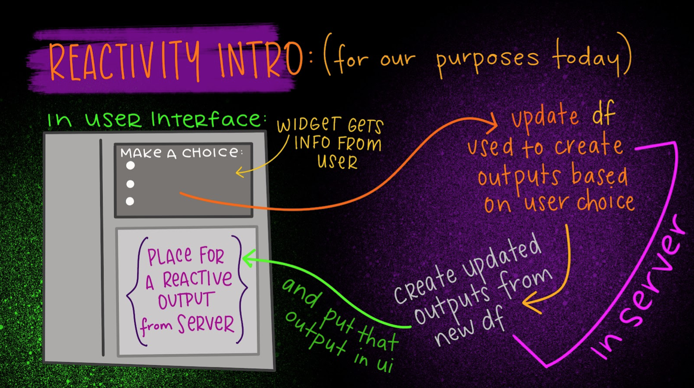
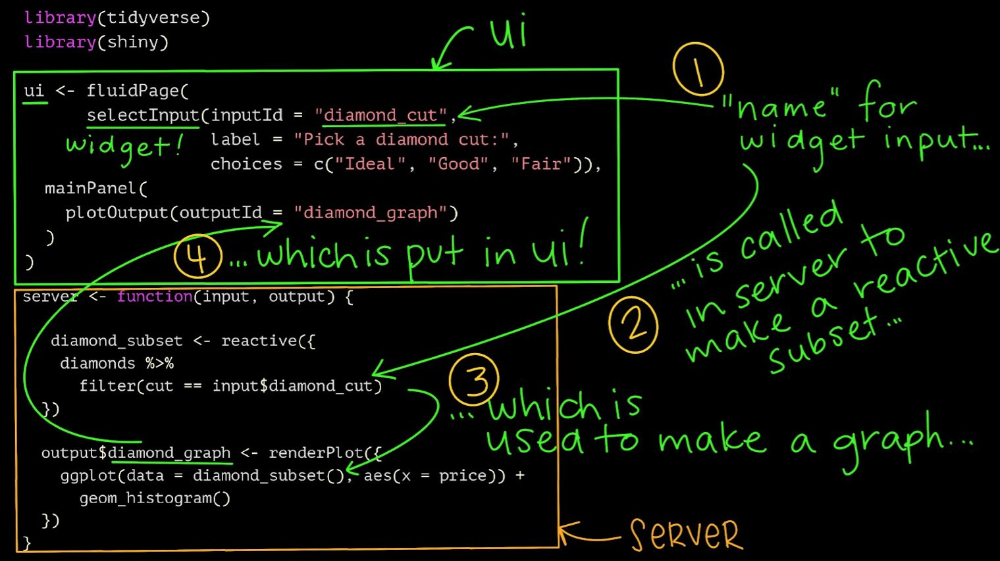

```{r setup, include=FALSE}
knitr::opts_chunk$set(echo = FALSE)

library(fontawesome)
library(knitr)
library(kableExtra)
library(dplyr)
library(hexSticker)
library(ggplot2)
library(shiny)
library(vembedr)

options(kableExtra.html.bsTable = T)

```

# What's in the lectures and tutorials for this Chapter?

This week we look at some more advanced aspects of building Shiny apps, in particular **reactivity**. After working through the pre-recorded lecture and the `learnr` tutorial (which covers both Chapter 8 and Chapter 9), you will have a good understanding of the principles of _reactivity_ in Shiny apps, as summaried by these three very colourful slides by Allison Horst:

```{r reactivity-1, preview=TRUE}

```

```{r reactivity-2, preview=TRUE}
knitr::include_graphics("images/horst_reactivity2.png")
```

```{r reactivity-3, preview=TRUE}

```

After viewing the pre-recorded lecture below (the slide deck for it is available below the video), you should go through the interactive `learnr` tutorial for this chapter (see below). 


```{r ch8-video, preview=TRUE}
embed_url("https://youtu.be/6lMhwtylLlU")
```

[**Slide deck for Chapter 8**](assets/HDAT9800-2022-T2-Chapter-8.pdf)

After you have viewed the lecture, please proceed to do the related `reactivity in shiny` tutorial (see below).

#  `learnr` tutorial for Chapters 8 & 9

You should download and re-install the `hdat9800` tutorials package for `R` by following the instructions provided on the home page. Instructions for installing `R` and `RStudio` are provided [here](installing_r.html).

The tutorial for this chapter is also available [online](https://cbdrh.shinyapps.io/reactivity/) via the link from the course schedule table on the course home page.

The tutorial covers much of the same  material as in the pre-recorded lecture, but goes into quite a lot more detail. 

If you have any questions about the lectures or tutorials, or if you want to share any useful resources or post insights, please post in the [Teams space](https://teams.microsoft.com/l/channel/19%3af1876c04b0a44549bd2aa63050155355%40thread.tacv2/Chapter%25206?groupId=40f150b6-6fa9-478e-875f-cd02465b18a2&tenantId=3ff6cfa4-e715-48db-b8e1-0867b9f9fba3) for the course, in the channel for Chapter 8.

# Interactive sessions for Chapter 8

In the interactive session we will have a guest presentation from Dr Mark Hanly on communicating research work on modelling the COVID-19 outbreak and response, followed by the usual Q&A session. We will resume hands-on coding practice in the interactive sessions for Chapters 9 and 10 (in weeks 10 and 11, please see the course timetable on the home page).

# Chapter 8 assessment exercise

There is **no** assessment for Chapter 8 (nor Chapter 9, nor Chapter 10). Concentrate on your individual additional assessment and your group assessment projects instead.

<aside>
```{r course-logo, preview=TRUE}
knitr::include_graphics("images/all_the_things.png")
```
</aside>

# Readings and Resources for Chapter 8

There are no new readings for this week, to allow everyone to catch up. Thus we will revisit Chapters 10 and 11 of Wilke.

```{r, eval=TRUE, include=TRUE}

reading = c(
      "Claus O. Wilke. Fundamentals of Data Visualization. Chapter 13 - Visualising time series and other functions of an independent variable",
      "Claus O. Wilke. Fundamentals of Data Visualization. Chapter 14 - Visualising trends",
      "RStudio. Building Web Applications with Shiny - module 3 - reactivity essentials"
    )

links <- c(
  "<a class='fa fa-globe' href='https://clauswilke.com/dataviz/time-series.html' target='_blank'></a>",
  "<a class='fa fa-globe' href='https://clauswilke.com/dataviz/visualizing-trends.html' target='_blank'></a>",
  "<a class='fa fa-globe' href='https://minecr.shinyapps.io/03-reactivity/' target='_blank'></a>"
  
)


df <- data.frame(
  reading = reading,
  links = links
)


kbl(df, escape = FALSE,
    align = c('l', 'c'),
    col.names = NULL) %>%
  kable_styling(bootstrap_options = "hover") %>% 
    kableExtra::group_rows(start_row = 1, end_row = 2, group_label = "Core readings")  %>% 
    kableExtra::group_rows(start_row = 3, end_row = 3, group_label = "Optional but recommended readings") 

```

<aside>

<br>

You should prioritise the core readings each week.  

</aside>


