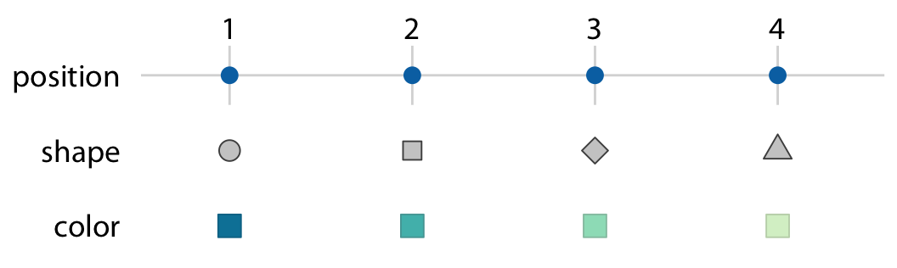

class: middle, center, title-slide
background-image: url("images/justblackbutwhy.png")
background-size: cover

#<br><br>HDAT9800 Health Data Visualisation & Communication<br><br>
## Chapter 2 Interactive Tutorial - blogging with `distill` 
#### Tim Churches<br>
#### UNSW Medicine
#### 8th June 2022


```{r setup, include=FALSE, purl=FALSE}

options(htmltools.dir.version = FALSE)
knitr::opts_chunk$set(fig.retina=2)

# First specify the packages of interest
packages = c("tidyverse", "distill", "kableExtra", "xaringan", "xaringanExtra")

## Now load or install & load all
package.check <- lapply(
  packages,
  FUN = function(x) {
    if (!require(x, character.only = TRUE)) {
      install.packages(x, dependencies = TRUE)
      library(x, character.only = TRUE)
    }
  }
)

library(tidyverse)
library(kableExtra)
library(distill)
```

```{r xaringan-themer, include=FALSE, warning=FALSE}

library(xaringanthemer)
style_duo_accent(
  primary_color = "#000000",
  secondary_color = "#ffdc00",
  link_color = "#00bfff",
  header_font_google = google_font("Rubik"),
  text_font_google   = google_font("Roboto", "300", "300i"),
  code_font_google   = google_font("Roboto Mono")
)
```

```{r xaringan-tile-view, echo=FALSE}
xaringanExtra::use_tile_view()
```

```{r xaringan-panelset, echo=FALSE}
xaringanExtra::use_panelset()
```

```{r xaringan-animate-css, echo=FALSE}
xaringanExtra::use_animate_css()
```

```{css, echo = FALSE}
# for changing font size in code blocks
.remark-slide-content {
  font-size: 28px;
  padding: 20px 80px 20px 80px;
}
.remark-code, .remark-inline-code {
  background: #f0f0f0;
}
.remark-code {
  font-size: 24px;
}
.huge .remark-code { /*Change made here*/
  font-size: 200% !important;
}
.smallcode .remark-code { /*Change made here*/
  font-size: 80% !important;
}
.tiny .remark-code { /*Change made here*/
  font-size: 66% !important;
}
```

---

# Agenda for Chapter 2 interactive session

- Chapter 1
  - lots of content 
  - learning SQL - a good idea but not essential
  - challenge solutions (to be posted in Teams)
  - Q & A
  - assessment and requesting early marking

---

# Agenda for Chapter 2 interactive session, cont'd

- Chapter 2
  - deliberately less content this week
  - Q & A
  - core readings (Wilke Chapters 1 & 2 recap in preparation for Chapter 3)
  - hands-on blogging with `distill` for `R`
    - review of how the internet and Web work
    - types of web site architectures/platforms
    - the blogosphere as a means of technical communication
    - overview of `distill`
    - hands-on setting up your own blog site
    
---

# Chapter 1 recap

- lots of content
  - especially if you are new to `R` or to programming
  - don't panic!
  - we are here to help
  - no-one expects to to be an instant _Top Gun_ coder
  - it's a journey

---


---


---

# Chapter 1 recap

- git and GitHub confuse almost everyone at first
  - practice brings comfort

---


---


---

# Chapter 1 recap, cont'd

- `dplyr` and related packages (`tidyr`, `purrr`) worth learning
  - we'll cover `tidyr` and `purrr` briefly in a later interactive session 
  - learning SQL - a good idea, but not necessary for this course
- `dplyr`/`dbplyr` challenge solutions (to be posted in Teams)

---


---

# Chapter 1 recap, cont'd

- assessment
  - very easy, just to get you used to using `git` and `GitHub`
- procedure for [requesting early marking](https://cbdrh-hdat9800.github.io/requesting_early_marking.html)
- live demo of it (seeking a volunteer!)

---

# Chapter 1 recap, cont'd

- Q & A

---

# Chapter 2

- deliberately less content this week
- Q & A


---


---

# Wilke Chapter 1

- data visualisation is 50% art & 50% science
  - most important thing is to accurately communicate the data without distortion or bias (the science)
  - but do so in an aesthetically pleasing way (the art)
- scientists tend to be good at the science but are often aesthetically challenged
- artists and designers tend to be good at preparing beautiful or pleasing visualisations, but care less about the accuracy of what they are presenting
- three parts:
  - from data to visualisation
  - principles of figure/chart design
  - miscellaneous topics (not core reading for this course)
  
---

# Wilke Chapter 1, cont'd

- good and bad examples, using the same data
  - **ugly** - a chart with aesthetics problems (a matter of taste) but otherwise clear, informative and accurate
  - **bad** - a chart with perceptual problems, making it unclear, confusing, too complicated or possibly deceiving
  - **wrong** - a chart with objective, mathematical errors, indisputably incorrect
  
---


---

# wrong!

[An incorrect meta-analysis detected due to an incorrect chart](https://github.com/timchurches/meta-analyses/blob/master/benefits-of-reproducible-research/benefits-of-reproducible-research.md)

---

# Wilke Chapter 2

- restates the principles espoused by Leland Wilkinson, building on Bertin

- all data visualisations map data values onto quantifiable features of the chart or graphic
  - we call these feature _aesthetics_ (in a particular, technical sense, different from the usual meaning of _aesthetics_)

---

# Aesthetics and data types

- aesthetics describe every aspect of a particular graphical element
  - for example, the _position_ of a point (described by _x_ and _y_ values in a 2D chart)
  - graphical elements have a _shape_, a _size_, a _colour_, a _line type_, a _line width_  etc


---

# Data types in charts and graphics


---

# What are the data types in this table?


---

# Scales map data values onto aesthetics

- to map data values to _aesthetics_ we need to specify which data values correspond to which aesthetic values or characteristics
  - eg if our chart has an _x_ axis, we need to specify which data values (eg which column of data in a table/data frame) specify where element fall along the _x_ axis
  - this mapping is done via a _scale_
  - a _scale_ defines a unique mapping from data values to aesthetics
  - must be a one-to-one mapping, otherwise the graphic will be ambiguous or uninterpretable
  


---

# Mapping data to aesthetics in practice

- three columns from the table we saw earlier mapped to aesthetics


---

# An alternative mapping of the same data to aesthetics


---

# Five mappings of data to aesthetics


---

# Blogging and the blogosphere

- blogs are a value means of communicating your work in health data science
  - as the primary means for presenting your results (but don’t forget peer-reviewed scientific publishing)
  - to talk about how you got your results
    - data collection/sources, statistics and epidemiology, software
  - to discuss or comment on (constructively!) on other people’s work
  - training material and guides for others

---

# Data science blogosphere

- very rich, and growing
- a nice blog site is a great addition to your CV/resumé
- [Top 40 R programming blogs to follow in 2022](https://blog.feedspot.com/r_programming_blogs/)
- [R Bloggers blog aggregation site](https://www.r-bloggers.com)
- [Tim Churches' health data science blog](https://timchurches.github.io/blog/)

---

# Let's build our own blog sites

- GitHub allows you to publish static web pages from a GitHub repository 
  - see [GitHub Pages](https://pages.github.com) for details
  - we will leverage that to host our personal blog sites
  - **static** in the sense that the blog site is a set of static files served up by the GitHub Pages web server
  - but we can modify and add to that set of files at any time, and the blog site content will be updated according
  - all managed via git 

---

# Distill

  - has a sound theoretical underpinning -- see [Hohman _et al_., 2020](https://distill.pub/2020/communicating-with-interactive-articles/)
- a very nice framework for data science blogging (and websites)
  - a Distil scientific website: https://cbdrh.github.io/covoidance/
- see the Distill web sites for details
  - [intro to Distill](https://blog.rstudio.com/2020/12/07/distill/)
  - [re-intro to Distill](https://www.rstudio.com/blog/distill/)
  - [reference documentation site](https://rstudio.github.io/distill/)

---

# Overview of steps in setting up you own blog site

- create a repository (repo) for the blog under your personal GitHub account
  - should be a public repository
- set up a new RStudio project and clone the blog repo to your computer
- set up a new Distill blog site project in the same directory that you cloned the repo to
- do some initial customisation of the blog site
- rebuild the blog site
- commit to git and push back to the GitHub repo
- enable GitHub Pages in GitHub
- check if it worked

---

# Maintaining your own blog site

- further customisation of youg site
- modify an existing blog post
- add one or more new blog posts


---

# A video illustrating these steps 

- the steps are described in subsequent slides

```{r intro-video, echo=FALSE, preview=TRUE}
vembedr::embed_url("https://youtu.be/unur6FBh_x0")
```

---

# Install packages

- you need to install the `distill` package
  - this will automatically install all the other packages it depends on

```{r install-packages, eval=FALSE, echo=TRUE}

install.packages("distill", dependencies = TRUE)

```

---

# Create a new GitHub repo for your blog

- call it whatever you wish
  - but put "blog" in the name
- go to your GitHub home page
  - create a new repository
  - make it a public repository
  
---

# Clone that repo to you local computer using RStudio

---

# Load `distill` and create a new web site

```{r create-website, eval=FALSE, echo=TRUE}

library(distill)
create_blog(dir = ".", title = "My Blog")

```

---

# Exit RStudio then re-open your blog project in RStudio

- double click on the `.Rproj` file for yiur blog project to re-open the project in RStudio
  - this is necessary so that RStudio detects that you are using `distill` so that a **Build** tab appears in the upper-right pane in RStudio
  
---

# Set up GitHub Pages

- change Pages branch and directory to:
  - branch main
  - directory docs/ 

---

# Make a `.nojekyll` file in your blog repo

This tells Google Pages not to do any further transformation of web pages using something called `jekyll`

```{r create-nojekyll, eval=FALSE, echo=TRUE}


file.create(".nojekyll")

```

---

# Adjust _site.yml to suit

- adjust the `output_dir` parameter to `docs`

---

# Build the site

- click on the **Build** tab in the upper-right pane in RStudio, then click **Build Website**

---

# Commit all modified files to git then push to GitHub

- then wait a bit
- check if published by accessing the URL for your GitHub Pages site provided in the Pages setup screen on GitHub

---

# Create a new post

```{r create-new-post, eval=FALSE, echo=TRUE}

create_post("I love blogging")

```

- then knit that post so it is rendered
- rebuild the website (see above)
- commit all changes to git and push to GitHub

---

# Customise!

[https://rstudio.github.io/distill/](https://rstudio.github.io/distill/)

---

# Enough (for now)!

