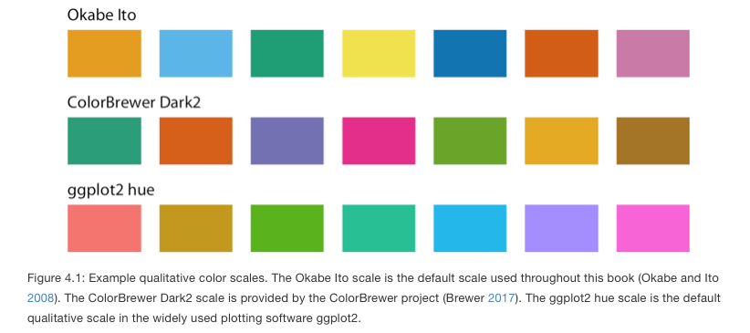

class: middle, center, title-slide
background-image: url("images/justblackbutwhy.png")
background-size: cover

#<br><br>HDAT9800 Health Data Visualisation & Communication<br><br>
## Chapter 3 Interactive Tutorial -- more on visualsiation with `ggplot2` 
#### Tim Churches<br>
#### UNSW Medicine
#### 8th June 2022


```{r setup, include=FALSE, purl=FALSE}

options(htmltools.dir.version = FALSE)
knitr::opts_chunk$set(fig.retina=2)

# First specify the packages of interest
packages = c("tidyverse", "kableExtra", "xaringan", "xaringanExtra")

## Now load or install & load all
package.check <- lapply(
  packages,
  FUN = function(x) {
    if (!require(x, character.only = TRUE)) {
      install.packages(x, dependencies = TRUE)
      library(x, character.only = TRUE)
    }
  }
)

if (!require("medicaldata", character.only = TRUE)) {
      remotes::install_github("CBDRH-HDAT9800/medicaldata", dependencies = TRUE)
      library("medicaldata", character.only = TRUE)
    }


library(tidyverse)
library(kableExtra)
library(medicaldata)
```

```{r xaringan-themer, include=FALSE, warning=FALSE}

library(xaringanthemer)
style_duo_accent(
  primary_color = "#000000",
  secondary_color = "#ffdc00",
  link_color = "#00bfff",
  header_font_google = google_font("Rubik"),
  text_font_google   = google_font("Roboto", "300", "300i"),
  code_font_google   = google_font("Roboto Mono")
)
```

```{r xaringan-tile-view, echo=FALSE}
xaringanExtra::use_tile_view()
```

```{r xaringan-panelset, echo=FALSE}
xaringanExtra::use_panelset()
```

```{r xaringan-animate-css, echo=FALSE}
xaringanExtra::use_animate_css()
```

```{css, echo = FALSE}
# for changing font size in code blocks
.remark-slide-content {
  font-size: 28px;
  padding: 20px 80px 20px 80px;
}
.remark-code, .remark-inline-code {
  background: #f0f0f0;
}
.remark-code {
  font-size: 24px;
}
.huge .remark-code { /*Change made here*/
  font-size: 200% !important;
}
.smallcode .remark-code { /*Change made here*/
  font-size: 80% !important;
}
.tiny .remark-code { /*Change made here*/
  font-size: 66% !important;
}
```

---

# Agenda for Chapter 3 interactive session

  - Q & A
  - core readings (Wilke Chapters 3, 4 & 5 recap )
  - diving deeper into `ggplot2` with some hands-on coding
    - a quick look at the `patchwork` package

---


---


# Chapter 2

- Q & A

---

# Wilke Chapter 3 - coordinate systems and axes

- position scales are needed to determine where on a chart different data values should be shown
- for typical 2D charts, we need two position scales
  - usually these scales correspond to the _x_ and _y_ coordinates of a plot
  - the geometric arrangement of the scales also needs to be specified (even if implicitly)
  - conventionally the _x_ axis is the horizontal axis and the _y_ axis is the vertical axis
  - but it doesn't have to be so: the _y_ axis could, for example, run at some angle other than 90 degrees to the _x_ axis, or one axis could run in a circle and the other run radially to that circle
  - the combination of a set of position scales and their relative geometric arrangement is known as a _coordinate system_
  
---

# Wilke Chapter 3 - Cartesian coordinates

- the most commonly used coordinate system 
  - _x_ and _y_ axes are orthogonal (at 90 degrees to each other)
  - represent continuous scales, can show both positive and negative values
  - requires a range to be specified for each axis
---


---

# Wilke Chapter 3 - Cartesian coordinates, cont'd

- data values almost always have units:
  - temperature in degrees Celsius
  - distance in millimetres, metre, kilometres etc
  - time in minutes, hours, days or dates, months, years
- charts often use scales representing different units for each axis
  - the drawing of axes may be expanded or contracted
  - spacing of units doesn't need to be the same if the _x_ and _y_ units are different 
  - Cleveland's principle of 45 degree "banking"
  - [https://idl.cs.washington.edu/files/2006-Banking-InfoVis.pdf}(https://idl.cs.washington.edu/files/2006-Banking-InfoVis.pdf)
  - [Banking slopes to 45 degrees with `ggthemes`](https://jrnold.github.io/ggthemes/reference/bank_slopes.html)
  
---


---

# Wilke Chapter 3 - same units on both axes

- if the units for the _x_ and _y_ axes are the same, then the scale should map them to the chart with the same grid spacings
- Cartesian coordinates are invariant under linear transformations (such as "centring")


---

# Wilke Chapter 3 - nonlinear axes

- Cartesian coordinate systems are linear: grid lines and tick marks are spaced evenly
- but with a nonlinear scale, even spacing in data units corresponds to uneven spacing in the visualisation, or even spacing in the visualisation corresponds to unequal spacing in the underlying data units
- _logarithmic_ scales are the most commonly used type of nonlinear scale
  - they are _multiplicative_, meaning they are linear in multiplication
  - need to log-transform the underlying data values and exponentiate the numbers shown on the chart
  - or leave the data values as they are and use a log scale on the chart
  - mathematically, there is no difference between plotting the log-transformed data on a linear scale or plotting the original data on a logarithmic scale
  - the only difference lies in the labelling for the individual axis ticks and for the axis as a whole

---


---

# Wilke Chapter 3 - plotting ratios

- multiplication on a log scale looks like addition on a linear scale
  - thus log scales are useful for data that have been obtained by multiplication or division, especially ratios

---


---


---

# Wilke Chapter 3 - plotting ratios

- what are some commonly visualised ratios in health data science?

---

# Plotting odds ratios

```{r, echo=TRUE, message=FALSE}
library(finalfit)
explanatory <- c( "differ.factor", "age", "sex.factor", 
                "extent.factor", "obstruct.factor", 
                "nodes")
dependent <- "mort_5yr"
table2 <- colon_s %>% 
  finalfit(dependent, explanatory, 
           dependent_label_prefix = "")
```

---

```{r, echo=FALSE}
knitr::kable(table2)
```

---

```{r, echo=TRUE, message=FALSE, warning=FALSE, fig.width=12, fig.asp=0.6}
colon_s %>% 
  or_plot(dependent, explanatory, 
          breaks = c(0.5, 1, 5, 10, 20, 30),
          table_text_size = 3.5)
```

---

# Wilke Chapter 3 - curved axes

- _polar_ coordinates specify the _x_ axis as an angle around a central point and the _y_ axis as a radial distance 


---

# Wilke Chapter 3 - periodic polar axes


---

# A polar polar plot!

[https://www.tylermw.com/polar-ice-data-in-r-with-rayrender/](https://www.tylermw.com/polar-ice-data-in-r-with-rayrender/)

---

# Wilke Chapter 3 - geographic projections


---

# Wilke Chapter 4 - colour scales

- three main use cases for colour in data visualisations
  - to distinguish groups from each other
  - to represent data values
  - to highlight particular data points
  
---

# Wilke Chapter 4 - colour to distinguish groups

- qualitative colour scales
  - groups have no intrinsˆc order or ranking
  - colours should look distinct from each other
  - no particular colours should stand out
  - colours should not convey the impression of an order
  
---

# Wilke Chapter 4 - colour to distinguish groups



---


---

# Wilke Chapter 4 - colour to represent data values

- we use _sequential_ colours to represent values on a data scale
- _sequential_ colours need to clearly indicate which colours represent larger values and which colours represent smaller values
  - ideally these representations need to be perceived uniformly across the colour scale
  - that is difficult to achieve
  - there are individual and cultural differences
- _sequential colours scales_ can be based on a single hue (eg light blue to dark blue)
- or on multiple hues (eg dark red to light yellow)
  - multi-hue scales tend to mimic the natural world eg dark red to light yellow
    - dark yellow to light red looks wrong

---

# Wilke Chapter 4 - colour to represent data values


---

# Wilke Chapter 4 - sequential colour scales on choropleth maps


---

# Wilke Chapter 4 - divergent colour scales

- sometimes we want to show divergence from some central or neutral value in both positive and negative directions
  - an OR (odds ratio) chart is an example, where the neutral point is OR=1.0
- a _divergent_ colour scale is used
  - just two _sequential_ colour scales stitched together
  - need to be balanced (difficult!)
  - saturation of colour is often used, as well as hue
  - we'll cover HLS and other colour models later
  
---

# Wilke Chapter 4 - divergent colour scales


---

# Wilke Chapter 4 - divergent colour scale on a choropleth map


---


# Wilke Chapter 4 - colour to highlight values

- colour can be used to highlight specific data values or groups of values
  - usually to emphasise some aspect of a story you want to tell
  - beware of personal bias!
- we use an _accent_ colour scale for highlighting
  - contain both subdued colours and stronger colours
  - the baseline colours shouldn't compete with the highlight colour

---


---


---


---

# Wilke Chapter 5 - directory of visualisations

[https://clauswilke.com/dataviz/directory-of-visualizations.html](https://clauswilke.com/dataviz/directory-of-visualizations.html)

---

# Hands-on: more on `ggplot2`

- based on Chapter 3 of _R for Data Science_ by Hadley Wickham and Garret Grolemund
  - available at [https://r4ds.had.co.nz/index.html](https://r4ds.had.co.nz/index.html)
  
---

# Pre-requisites

- install the `ggplot2` package
  - or better, the `tidyverse` meta-package
  
- install a fork of the `medicaldata` package from GitHub

```{r, echo=TRUE}
remotes::install_github("cbdrh-hdat9800/medicaldata")
```

- load the libraries

```{r, echo=TRUE}
library(tidyverse)
library(medicaldata)
```

---

# the `diabetes` dataset

- at the R Console, type `?diabetes`

- examine the data with `head(dibetes)`
  - or `glimpse(diabetes)`

---

# Create a ggplot

- using the `diabetes` dataset, write code to create a scatter plot of `age` versus `bmi`

---

```{r, echo=TRUE}
ggplot(data = diabetes, aes(x = age, y = bmi)) + 
  geom_point()
```

---

```{r, echo=TRUE}
ggplot(data = diabetes) + 
  geom_point(mapping = aes(x = age, y = bmi))
```

---

# A graphing template

```{r, echo=TRUE, eval=FALSE}
ggplot(data = <DATA>) + 
  <GEOM_FUNCTION>(mapping = aes(<MAPPINGS>))
```

---

# Exercise 1

- make a scatter plot of `bmi` versus `glucose_mg-dl`

---

```{r, echo=TRUE, eval=FALSE}
ggplot(data = diabetes, aes(x = bmi, y = glucose_mg-dl)) + 
  geom_point()
```

---

# We need to rename that column!

```
diab <- diabetes %>%
          rename(glucose_mg-dl = glucose_mg_dl)
```

--- 

---

# A better way

```{r, echo=TRUE}
library(janitor)

diab <- clean_names(diabetes)

glimpse(diab)
```

---

```{r, echo=TRUE}

ggplot(data = diab, aes(x = bmi, y = glucose_mg_dl)) + 
  geom_point()
```

---

# Exercise 2

- make a scatter plot of `bmi` versus `diabetes_5y`
- why is it not very useful?

---
 
```{r, echo=TRUE}
ggplot(data = diab) + 
  geom_point(mapping = aes(x = bmi, y = diabetes_5y))
```

---

# Add further aesthetic mappings

- start with our earlier plot of `age` vs `bmi`
- add a additional aesthetic mapping of `diabetes_5y` to the `colour` aesthetic

---

```{r, echo=TRUE}
ggplot(data = diab) + 
  geom_point(mapping = aes(x = age, y = bmi, colour = diabetes_5y))
```

---

# Experiment 3

- what happens if we map `diabetes_5y` to the `size` aesthetic instead of the `colour` aesthetic?

---

```{r, echo=TRUE}
ggplot(data = diab) + 
  geom_point(mapping = aes(x = age, y = bmi, size = diabetes_5y))
```

---

# Warning: Using size for a discrete variable is not advised.

- repeat that but mapping `diabetes_5y` to the `alpha` aesthetic and then to the `shape` aesthetic

---

```{r, echo=TRUE}
ggplot(data = diab) + 
  geom_point(mapping = aes(x = age, y = bmi, alpha = diabetes_5y))
```

---

```{r, echo=TRUE}
ggplot(data = diab) + 
  geom_point(mapping = aes(x = age, y = bmi, shape = diabetes_5y))
```

---

# Manually setting an aesthetic

- how would you make the colour of all the points green?

---

```{r, echo=TRUE}
ggplot(data = diab) + 
  geom_point(mapping = aes(x = age, y = bmi), colour = "green")
```

---

# Why does this happen?

```{r, echo=TRUE}
ggplot(data = diab) + 
  geom_point(mapping = aes(x = age, y = bmi, colour = "green"))
```

---

# Experiment 4

- write some code to see what the `stroke` aesthetic does, using `age` for the x-axis, `bmi` for the y-axis and `pedigree` for the `stroke` aesthetic mapping

---

```{r, echo=TRUE}
ggplot(data = diab) + 
  geom_point(mapping = aes(x = age, y = bmi, stroke = pedigree))
```

---

# Facets

- an alternative to mapping additional variables to aesthetics
- create lots of smaller plots broken down (conditioned on) additional variables instead
- Tufte's "small multiples"

---

# Add a one-dimensional facetting

- write some code to add faceting by the `diabetes_5y` variable to a scatter plot of `age` for the x-axis and `bmi` for the y-axis

- hint: look at `facet_wrap()` in `ggplot2`
  - use `?facet_wrap` at the Console prompt of visit the ggplot2 documentation web site
  
---

```{r, echo=TRUE}
ggplot(data = diab) + 
  geom_point(mapping = aes(x = age, y = bmi)) +
  facet_wrap(~ diabetes_5y)
```

---

# Adjust the number of facetting rows (or columns)

- add `nrow = 2` as an additional argument to the `facet_wrap()` function

---

```{r, echo=TRUE}
ggplot(data = diab) + 
  geom_point(mapping = aes(x = age, y = bmi)) +
  facet_wrap(~ diabetes_5y, nrow = 2)
```

---

# Facet by two variables

- facet the plot by both `diabetes_5y` and `pregnancy_num`
  - hint: see `?facet_grid` at the Console prompt or on the `ggplot2` web site
  
---

```{r, echo=TRUE}
ggplot(data = diab) + 
  geom_point(mapping = aes(x = age, y = bmi)) +
  facet_grid(pregnancy_num ~ diabetes_5y)
```

---

# Too many facets!

- we need to reduce the number of categories for `pregnancy_num`
- many ways to do that, but here's one way
  - make a new column called `preg_group`
  
```{r, echo=TRUE}
diab2 <- diab %>%
          mutate(preg_group = case_when(pregnancy_num == 0 ~ "None",
                                        pregnancy_num >= 1 & pregnancy_num <= 3 ~ "1 to 3",
                                        pregnancy_num >= 4 & pregnancy_num <= 7 ~ "4 to 7",
                                        pregnancy_num >= 8 ~ "8 or more",
                                        TRUE ~ "other"))
```

---

```{r, echo=TRUE}
ggplot(data = diab2) + 
  geom_point(mapping = aes(x = age, y = bmi)) +
  facet_grid(preg_group ~ diabetes_5y)
```

---

# How can we fix the ordering of the `preg_group` facet?

---

```{r, echo=TRUE}
diab3 <- diab2 %>%
          mutate(preg_group = ordered(preg_group, 
                                      levels = c("None", "1 to 3", "4 to 7", "8 or more")))
                                                 
ggplot(data = diab3) + 
  geom_point(mapping = aes(x = age, y = bmi)) +
  facet_grid(preg_group ~ diabetes_5y)
```

---

# Exploring geometric objects (geoms)

- how are these two plots similar?

---

```{r, echo=FALSE, warning=FALSE}
ggplot(data = diab3) + 
  geom_point(mapping = aes(x = age, y = bmi)) 
```

---

```{r, echo=FALSE, warning=FALSE}
ggplot(data = diab3) + 
  geom_smooth(mapping = aes(x = age, y = bmi)) 
```

---

# Exploring geometric objects (geoms)

- how are these two plot similar?

```{r, echo=TRUE, eval=FALSE}
ggplot(data = diab3) + 
  geom_point(mapping = aes(x = age, y = bmi)) 

ggplot(data = diab3) + 
  geom_smooth(mapping = aes(x = age, y = bmi)) 
```

---

# Add an additional aesthetic mapping to `geom_smooth()`

- map `diabetes_5y` to the `linetype` aesthetic

---

```{r, echo=TRUE, eval=TRUE}
ggplot(data = diab3) + 
  geom_smooth(mapping = aes(x = age, y = bmi, linetype = diabetes_5y)) 
```

---


# More next week!

- we'll have a regular `ggplot2` hands-on session almost every week from now on
  - by the end of teh course you'll be wizards!
  


