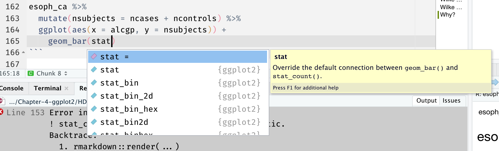

class: middle, center, title-slide
background-image: url("images/justblackbutwhy.png")
background-size: cover

#<br><br>HDAT9800 Health Data Visualisation & Communication<br><br>
## Chapter 4 Interactive Tutorial -- more on visualisation with `ggplot2` 
#### Tim Churches<br>
#### UNSW Medicine
#### 22nd June 2022


```{r setup, include=FALSE, purl=FALSE}

options(htmltools.dir.version = FALSE)
knitr::opts_chunk$set(fig.retina=2)

# First specify the packages of interest
packages = c("tidyverse", "kableExtra", "xaringan", "xaringanExtra")

## Now load or install & load all
package.check <- lapply(
  packages,
  FUN = function(x) {
    if (!require(x, character.only = TRUE)) {
      install.packages(x, dependencies = TRUE)
      library(x, character.only = TRUE)
    }
  }
)

if (!require("medicaldata", character.only = TRUE)) {
      remotes::install_github("CBDRH-HDAT9800/medicaldata", dependencies = TRUE)
      library("medicaldata", character.only = TRUE)
    }


library(tidyverse)
library(kableExtra)
library(medicaldata)
```

```{r xaringan-themer, include=FALSE, warning=FALSE}

library(xaringanthemer)
style_duo_accent(
  primary_color = "#000000",
  secondary_color = "#ffdc00",
  link_color = "#00bfff",
  header_font_google = google_font("Rubik"),
  text_font_google   = google_font("Roboto", "300", "300i"),
  code_font_google   = google_font("Roboto Mono")
)
```

```{r xaringan-tile-view, echo=FALSE}
xaringanExtra::use_tile_view()
```

```{r xaringan-panelset, echo=FALSE}
xaringanExtra::use_panelset()
```

```{r xaringan-animate-css, echo=FALSE}
xaringanExtra::use_animate_css()
```

```{css, echo = FALSE}
# for changing font size in code blocks
.remark-slide-content {
  font-size: 28px;
  padding: 20px 80px 20px 80px;
}
.remark-code, .remark-inline-code {
  background: #f0f0f0;
}
.remark-code {
  font-size: 24px;
}
.huge .remark-code { /*Change made here*/
  font-size: 200% !important;
}
.smallcode .remark-code { /*Change made here*/
  font-size: 80% !important;
}
.tiny .remark-code { /*Change made here*/
  font-size: 66% !important;
}
```

---

# Agenda for Chapter 4 ggplot2 interactive session

  - recap core readings (Wilke Chapters 6)
  - reproduce and extend the example charts Wilke provides using different (medical) datasets
  - a quick look at the `patchwork` package


---

# Wilke Chapter 6 - visualising amounts

- let's use the `medicaldata` library again
- if not installed:

`remotes::install_github("CBDRH-HDAT9800/medicaldata")`
  
---

# Wilke section 6.1 - Bar plots

- write some R code using `ggplot2` to make a bar chart using the `esoph_ca` dataset in the `medicaldata` package to create a bar chart which shows:
  - `nsubjects` on the y-axis (you'll need to add (sum)  `ncases` and `ncontrols` to create an `nsubjects` column using `dplyr`
  - `alcgrp` on the x-axis
- examine the `esoph_ca` dataset and its documentation (`?esoph_ca`) first!

---

```{r, eval=FALSE, echo=TRUE}
library(tidyverse)
library(medicaldata)

esoph_ca %>%
  mutate(nsubjects = ncases + ncontrols) %>%
  ggplot(aes(x = alcgp, y = nsubjects)) +
    geom_bar()
```

---

# Why?


---



---

```{r, eval=FALSE, echo=TRUE}
esoph_ca %>%
  mutate(nsubjects = ncases + ncontrols) %>%
  ggplot(aes(x = alcgp, y = nsubjects)) +
    geom_bar(stat = "identity")
```

---

```{r, eval=TRUE, echo=FALSE}
esoph_ca %>%
  mutate(nsubjects = ncases + ncontrols) %>%
  ggplot(aes(x = alcgp, y = nsubjects)) +
    geom_bar(stat = "identity")
```

---

```{r, eval=FALSE, echo=TRUE}
esoph_ca %>%
  mutate(nsubjects = ncases + ncontrols) %>%
  ggplot(aes(x = alcgp, y = nsubjects)) +
    geom_bar(stat = "identity", col = "cyan")
```

---

```{r, eval=TRUE, echo=FALSE}
esoph_ca %>%
  mutate(nsubjects = ncases + ncontrols) %>%
  ggplot(aes(x = alcgp, y = nsubjects)) +
    geom_bar(stat = "identity", colour = "cyan")
```

---

```{r, eval=TRUE, echo=TRUE}
esoph_ca %>%
  mutate(nsubjects = ncases + ncontrols) 
```

---

```{r, eval=TRUE, echo=TRUE}
esoph_ca %>%
  mutate(nsubjects = ncases + ncontrols) %>%
  group_by(alcgp) %>%
  summarise(nsubjects = sum(nsubjects))
```

---

```{r, eval=TRUE, echo=TRUE}
esoph_ca %>%
  group_by(alcgp) %>%
  summarise(nsubjects = sum(ncases) + sum(ncontrols))
```

---

```{r, eval=TRUE, echo=TRUE}
esoph_ca %>%
  group_by(alcgp) %>%
  summarise(nsubjects = sum(ncases + ncontrols))
```

---

```{r, eval=FALSE, echo=TRUE}
esoph_ca %>%
  group_by(alcgp) %>%
  summarise(nsubjects = sum(ncases + ncontrols)) %>%
  ggplot(aes(x = alcgp, y = nsubjects)) +
    geom_bar(stat = "identity", colour = "cyan")
```

---

```{r, eval=TRUE, echo=FALSE}
esoph_ca %>%
  group_by(alcgp) %>%
  summarise(nsubjects = sum(ncases + ncontrols)) %>%
  ggplot(aes(x = alcgp, y = nsubjects)) +
    geom_bar(stat = "identity", colour = "cyan")
```

---

# Make it prettier

- add `theme_minimal()`
- choose and set a fill colour for the bars
- label the x-axis and y-axis better 

---

```{r, eval=FALSE, echo=TRUE}
esoph_ca %>%
  group_by(alcgp) %>%
  summarise(nsubjects = sum(ncases + ncontrols)) %>%
  ggplot(aes(x = alcgp, y = nsubjects)) +
    geom_bar(stat = "identity", fill = "lightblue") +
    labs(x="Alcohol consumption", 
         y="Number of subjects",
         title="Oesophageal cancer study") +
    theme_minimal()

```

---

```{r, eval=TRUE, echo=FALSE}
esoph_ca %>%
  group_by(alcgp) %>%
  summarise(nsubjects = sum(ncases + ncontrols)) %>%
  ggplot(aes(x = alcgp, y = nsubjects)) +
    geom_bar(stat = "identity", fill = "lightblue") +
    labs(x="Alcohol consumption", 
         y="Number of subjects",
         title="Oesophageal cancer study") +
    theme_minimal()
```

---

Return to Wilke section 6.1

---

# Flip the coordinates

---

```{r, eval=FALSE, echo=TRUE}
p <- esoph_ca %>%
  group_by(alcgp) %>%
  summarise(nsubjects = sum(ncases + ncontrols)) %>%
  ggplot(aes(x = alcgp, y = nsubjects)) +
    geom_bar(stat = "identity", fill = "lightblue") +
    labs(x="Alcohol consumption", 
         y="Number of subjects",
         title="Oesophageal cancer study") +
    theme_minimal()

p + coord_flip()
```

---

```{r, eval=TRUE, echo=FALSE}
p <- esoph_ca %>%
  group_by(alcgp) %>%
  summarise(nsubjects = sum(ncases + ncontrols)) %>%
  ggplot(aes(x = alcgp, y = nsubjects)) +
    geom_bar(stat = "identity", fill = "lightblue") +
    labs(x="Alcohol consumption", 
         y="Number of subjects",
         title="Oesophageal cancer study") +
    theme_minimal()

p + coord_flip()
```

---

# Substitute `agegp` for the x-axis

---

```{r, eval=TRUE, echo=FALSE}
p <- esoph_ca %>%
  group_by(agegp) %>%
  summarise(nsubjects = sum(ncases + ncontrols)) %>%
  ggplot(aes(x = agegp, y = nsubjects)) +
    geom_col(fill = "lightblue") +
    labs(x="Age group", 
         y="Number of subjects",
         title="Oesophageal cancer study") +
    theme_minimal()

p + coord_flip()
```

---

# Re-order the x-axis by descending number of subjects

- bad!
  - `agegrp` has a natural order, we shouldn't mess with it
  - but just as an exercise...
- note that `agegp` is a factor variable
  - hint: see `fct_reorder()` in the `forcats` package (part of `tidyverse` meta-package)

---

```{r, eval=FALSE, echo=TRUE}
esoph_ca %>%
  group_by(agegp) %>%
  summarise(nsubjects = sum(ncases + ncontrols)) %>%
  ggplot(aes(x = fct_reorder(agegp, desc(nsubjects)),
             y = nsubjects)) +
    geom_col(fill = "lightblue") +
    labs(x="Age group", 
         y="Number of subjects",
         title="Oesophageal cancer study") +
    coord_flip() +
    theme_minimal()
```

---

```{r, eval=TRUE, echo=FALSE}
esoph_ca %>%
  group_by(agegp) %>%
  summarise(nsubjects = sum(ncases + ncontrols)) %>%
  ggplot(aes(x = fct_reorder(agegp, desc(nsubjects)),
             y = nsubjects)) +
    geom_col(fill = "lightblue") +
    labs(x="Age group", 
         y="Number of subjects",
         title="Oesophageal cancer study") +
    coord_flip() +
    theme_minimal()
```

---

# Section 6.2 - grouped and stacked bars

---

# Grouped bars

- write some R code using `ggplot2` to make a bar chart using the `esoph_ca` dataset in the `medicaldata` package to create a bar chart which shows:
  - `nsubjects` on the y-axis (you'll need to add `ncases` and `ncontrols` to create an `nsubjects` column using `dplyr`
  - `alcgrp` on the x-axis
  - grouped bars for each value of `agegp`
- hint: the `position` argument to `geom_col()` or `geom_bar()`

---

```{r, eval=FALSE, echo=TRUE}
esoph_ca %>%
  group_by(alcgp, agegp) %>%
  summarise(nsubjects = sum(ncases + ncontrols)) %>%
  ggplot(aes(x = alcgp, y = nsubjects, fill = agegp)) +
    geom_col(position = "dodge") +
    labs(x="Alcohol consumption", 
         y="Number of subjects",
         title="Oesophageal cancer study") +
    theme_minimal()
```

---

```{r, eval=TRUE, echo=FALSE}
esoph_ca %>%
  group_by(alcgp, agegp) %>%
  summarise(nsubjects = sum(ncases + ncontrols)) %>%
  ggplot(aes(x = alcgp, y = nsubjects, fill = agegp)) +
    geom_col(position = "dodge") +
    labs(x="Alcohol consumption", 
         y="Number of subjects",
         title="Oesophageal cancer study") +
    theme_minimal()
```

---

# Change to facetting by `agegrp` with just one fill colour

- as suggested by Wilke

---

```{r, eval=FALSE, echo=TRUE}
esoph_ca %>%
  group_by(alcgp, agegp) %>%
  summarise(nsubjects = sum(ncases + ncontrols)) %>%
  ggplot(aes(x = alcgp, y = nsubjects)) +
    geom_col(fill="lightblue") +
    facet_wrap(~agegp) +
    labs(x="Alcohol consumption", 
         y="Number of subjects",
         title="Oesophageal cancer study") +
    theme_minimal()
```

---

```{r, eval=TRUE, echo=FALSE}
esoph_ca %>%
  group_by(alcgp, agegp) %>%
  summarise(nsubjects = sum(ncases + ncontrols)) %>%
  ggplot(aes(x = alcgp, y = nsubjects)) +
    geom_col(fill="lightblue") +
    facet_wrap(~agegp) +
    labs(x="Alcohol consumption", 
         y="Number of subjects",
         title="Oesophageal cancer study") +
    theme_minimal()
```

---

# Can you label the facets to show they are age group?

- hint: the `labeller=` argument to `facet_wrap()` and `facet_grid()`

---

```{r, eval=TRUE, echo=FALSE}
esoph_ca %>%
  group_by(alcgp, agegp) %>%
  summarise(nsubjects = sum(ncases + ncontrols)) %>%
  ggplot(aes(x = alcgp, y = nsubjects)) +
    geom_col(fill="lightblue") +
    facet_wrap(~agegp, labeller = label_both) +
    labs(x="Alcohol consumption", 
         y="Number of subjects",
         title="Oesophageal cancer study") +
    theme_minimal()
```

---

# Let's stack the bars by whether they are a case or control

- we need to reshape our dataset
  - one column holding the count of subjects
  - one column holding whether the count is for cases or control
- hint: the `pivot_longer()` function the `tidyr` package (part of the `tidyverse`)

---


---


---

# Step by step!

```{r, eval=TRUE, echo=TRUE}
esoph_ca
```

---

```{r, eval=TRUE, echo=TRUE}
esoph_ca %>%
  group_by(alcgp, agegp) %>%
  summarise(ncases = sum(ncases),
            ncontrols = sum(ncontrols))
```

---

```{r, eval=TRUE, echo=TRUE}
esoph_ca %>%
  group_by(alcgp, agegp) %>%
  summarise(ncases = sum(ncases),
            ncontrols = sum(ncontrols)) %>%
  pivot_longer(cols = c(ncases, ncontrols),
               names_to = "arm",
               values_to = "nsubjects")
```

---

```{r, eval=FALSE, echo=TRUE}
esoph_ca %>%
  group_by(alcgp, agegp) %>%
  summarise(ncases = sum(ncases),
            ncontrols = sum(ncontrols)) %>%
  pivot_longer(cols = c(ncases, ncontrols),
               names_to = "arm",
               values_to = "nsubjects") %>%
  ggplot(aes(x = alcgp, y = nsubjects, fill = arm)) +
    geom_col() +
    facet_wrap(~agegp, labeller = label_both) +
    labs(x="Alcohol consumption", 
         y="Number of subjects",
         title="Oesophageal cancer study") +
    theme_minimal()  
```

---

```{r, eval=TRUE, echo=FALSE}
esoph_ca %>%
  group_by(alcgp, agegp) %>%
  summarise(ncases = sum(ncases),
            ncontrols = sum(ncontrols)) %>%
  pivot_longer(cols = c(ncases, ncontrols),
               names_to = "arm",
               values_to = "nsubjects") %>%
  ggplot(aes(x = alcgp, y = nsubjects, fill = arm)) +
    geom_col() +
    facet_wrap(~agegp, labeller = label_both) +
    labs(x="Alcohol consumption", 
         y="Number of subjects",
         title="Oesophageal cancer study") +
    theme_minimal()  
```

---

```{r, eval=FALSE, echo=TRUE}
esoph_ca %>%
  group_by(alcgp, agegp) %>%
  summarise(ncases = sum(ncases),
            ncontrols = sum(ncontrols)) %>%
  pivot_longer(cols = c(ncases, ncontrols),
               names_to = "arm",
               values_to = "nsubjects") %>%
  ggplot(aes(x = alcgp, y = nsubjects, fill = arm, group = agegp)) +
    geom_col() +
    labs(x="Alcohol consumption", 
         y="Number of subjects",
         title="Oesophageal cancer study") +
    theme_minimal()  
```

---

```{r, eval=TRUE, echo=FALSE}
esoph_ca %>%
  group_by(alcgp, agegp) %>%
  summarise(ncases = sum(ncases),
            ncontrols = sum(ncontrols)) %>%
  pivot_longer(cols = c(ncases, ncontrols),
               names_to = "arm",
               values_to = "nsubjects") %>%
  ggplot(aes(x = alcgp, y = nsubjects, fill = arm, group = agegp)) +
    geom_col() +
    labs(x="Alcohol consumption", 
         y="Number of subjects",
         title="Oesophageal cancer study") +
    theme_minimal()  
```
---

```{r, eval=FALSE, echo=TRUE}
esoph_ca %>%
  group_by(alcgp, agegp) %>%
  summarise(ncases = sum(ncases),
            ncontrols = sum(ncontrols)) %>%
  pivot_longer(cols = c(ncases, ncontrols),
               names_to = "arm",
               values_to = "nsubjects") %>%
  ggplot(aes(x = alcgp, y = nsubjects, fill = arm, group = agegp)) +
    geom_col(position = "dodge2") +
    labs(x="Alcohol consumption", 
         y="Number of subjects",
         title="Oesophageal cancer study") +
    theme_minimal()  
```

---

```{r, eval=TRUE, echo=FALSE}
esoph_ca %>%
  group_by(alcgp, agegp) %>%
  summarise(ncases = sum(ncases),
            ncontrols = sum(ncontrols)) %>%
  pivot_longer(cols = c(ncases, ncontrols),
               names_to = "arm",
               values_to = "nsubjects") %>%
  ggplot(aes(x = alcgp, y = nsubjects, fill = arm, group = agegp)) +
    geom_col(position = "dodge2") +
    labs(x="Alcohol consumption", 
         y="Number of subjects",
         title="Oesophageal cancer study") +
    theme_minimal()  
```

---

# Section 6.3 Dotplots and heatmaps

---

# Draw a dotplot

- using the `esoph_ca` dataset in the `medicaldata` package to create a dot plot which shows:
  - `nsubjects` on the y-axis (you'll need to add `ncases` and `ncontrols` to create an `nsubjects` column using `dplyr`
  - `alcgrp` on the x-axis
  - fill the co-ordinates by 90 degrees
- hint: **not** `geom_dotplot()`!

---

```{r, echo=TRUE, eval = FALSE}
esoph_ca %>%
  group_by(alcgp) %>%
  summarise(nsubjects = sum(ncases + ncontrols)) %>%
  ggplot(aes(x = alcgp, y = nsubjects)) +
    geom_point(fill="lightblue") +
    labs(x="Alcohol consumption", 
         y="Number of subjects",
         title="Oesophageal cancer study") +
    theme_minimal() +
    coord_flip()
```

---

```{r, echo=FALSE, eval = TRUE}
esoph_ca %>%
  group_by(alcgp) %>%
  summarise(nsubjects = sum(ncases + ncontrols)) %>%
  ggplot(aes(x = alcgp, y = nsubjects)) +
    geom_point(fill="lightblue") +
    labs(x="Alcohol consumption", 
         y="Number of subjects",
         title="Oesophageal cancer study") +
    theme_minimal() +
    coord_flip()
```

---

# Heatmap of oesophageal cancer risk 

- summarise the `esoph_ca` so that we have the proportion of cases (that is, `ncases/(ncases + ncontrols)`) as a heatmap by `agegp` and `alcgp`
- hint: `geom_tile()`

---

```{r, echo=TRUE, eval = FALSE}
esoph_ca %>%
  group_by(alcgp, agegp) %>%
  summarise(risk = sum(ncases) / sum(ncases + ncontrols)) %>%
  ggplot(aes(x = agegp, y = alcgp, fill = risk)) +
    geom_tile() +
    labs(x="Age group", 
         y="Alcohol consumption",
         title="Oesophageal cancer study") +
    theme_minimal()
```

---

```{r, echo=FALSE, eval = TRUE}
esoph_ca %>%
  group_by(alcgp, agegp) %>%
  summarise(risk = sum(ncases) / sum(ncases + ncontrols)) %>%
  ggplot(aes(x = agegp, y = alcgp, fill = risk)) +
    geom_tile() +
    labs(x="Age group", 
         y="Alcohol consumption",
         title="Oesophageal cancer study") +
    theme_minimal()
```

---

# Challenge

- improve the colour palette and legend

---


---

# Patchwork

- an R package that allows you to easily arrange `ggplot2` charts in simple or complex arrangements 
[https://patchwork.data-imaginist.com](https://patchwork.data-imaginist.com)

---

