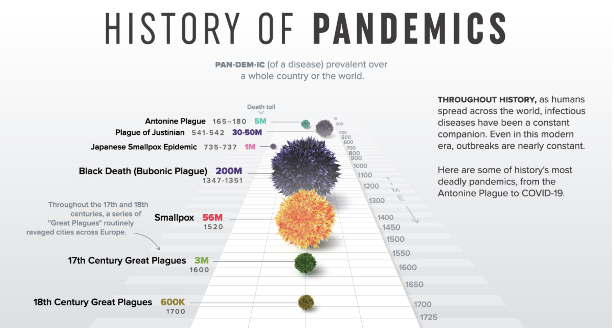
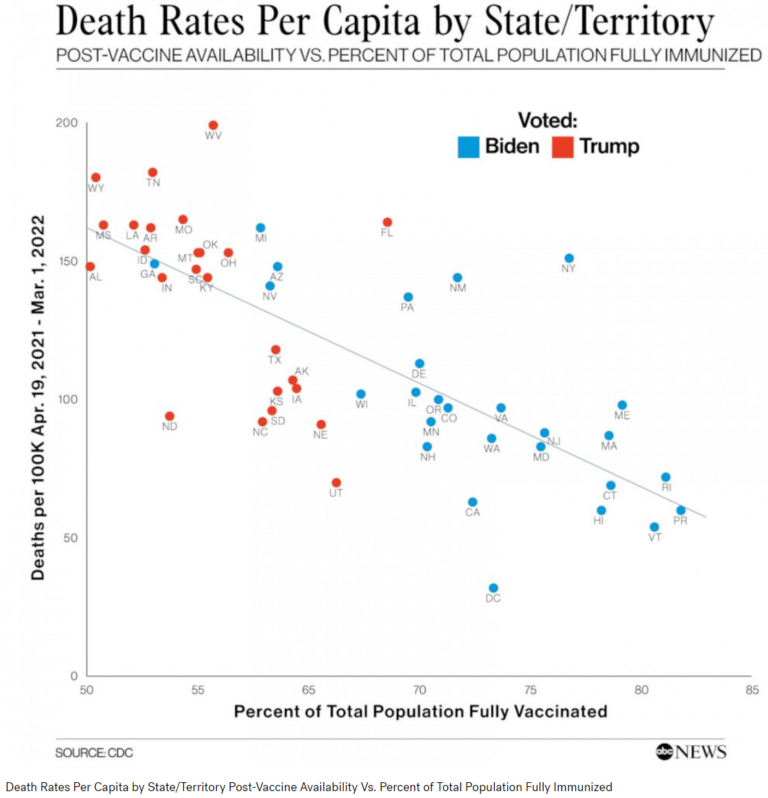

```{r setup, include=FALSE}
knitr::opts_chunk$set(echo = TRUE)
```

# Favourite visualisations

This page is a work-in-progress. More examples will be added in due course.

In no particular order.

## Tim Churches

From one of Edward Tufte's amazing series of books in data visualisation, in this case _Beautiful Evidence_..


...the page in which he introduces teh idea of _sparklines_, which are very small charts, stripped of all but the most releveant information and detail, which can be embedded in text (and tables). We will examone the use of sparklines later in this course.


---

## Melvin Galera

The now-famous Johns Hopkins COVID-19 map site, that became a major source of COVID updates in 202 and 2021. A great example of a health information dashboard, in this case built using the commercial ESRI GIS (geographic information system) software platform.

[Johns Hopkins COVID-19 Dashboard](https://coronavirus.jhu.edu/map.html)


---

## Ivana Deng

A World Bank project using unsupervised ML (machine learning) clustering of topics in large numbers of project reports. This methods finds emergent topic clusters in high dimensions. In order to visualise these, the high number of dimensions needs to be flattened using a technique called t-SNE, which we will examine briefly in this course.

The full World Bank report containing this image can be accessed [here](https://openknowledge.worldbank.org/bitstream/handle/10986/37117/Advanced-Content-Analysis-Can-Artificial-Intelligence-Accelerate-Theory-Driven-Complex-Program-Evaluation.pdf?sequence=1&isAllowed=y
).

[t-SNE flattening](images/tsne_flattening.png)


---

## Katy Liu

A great visualisation of teh size and impact of communicable disease pandemics through the ages. Click on the image below to be taken to the web page with the full visualisation.

[](https://www.visualcapitalist.com/history-of-pandemics-deadliest/)

---

```{r, eval=FALSE, include=FALSE}

https://nextstrain.org/monkeypox


---

https://www.pnas.org/doi/10.1073/pnas.1811634116

## Meg Stockwell

https://visme.co/blog/wp-content/uploads/2021/08/Plastic-Waste-Pollution-scaled.jpg

---

## Bishal Dhital

https://ourworldindata.org/grapher/life-expectancy-vs-health-expenditure?time=1960..2015

---

## Melissa Weerappah

https://www.youtube.com/watch?v=5EdMU6EFSkc

---

---

Yaru Ding

https://www.audit.vic.gov.au/report/child-and-youth-mental-health?section=

---

Emmanuel Mnatzaganian



https://abcnews.go.com/Health/red-blue-america-glaring-divide-covid-19-death/story?id=83649085

---

```
