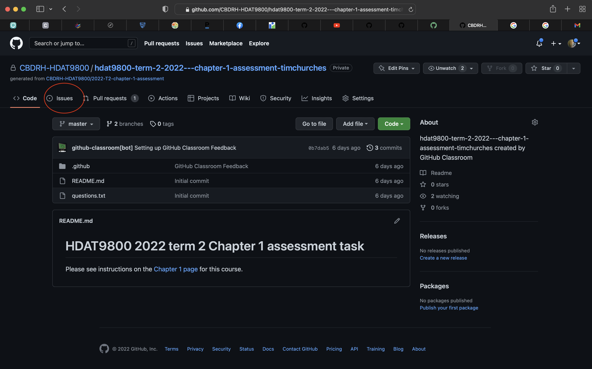
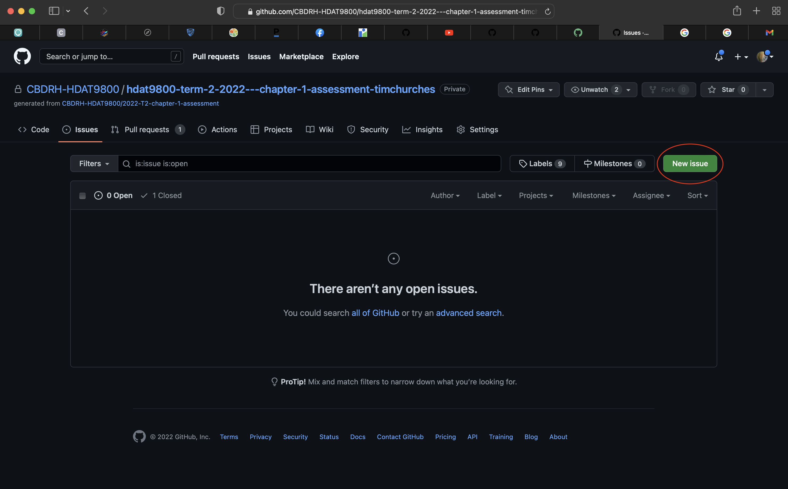
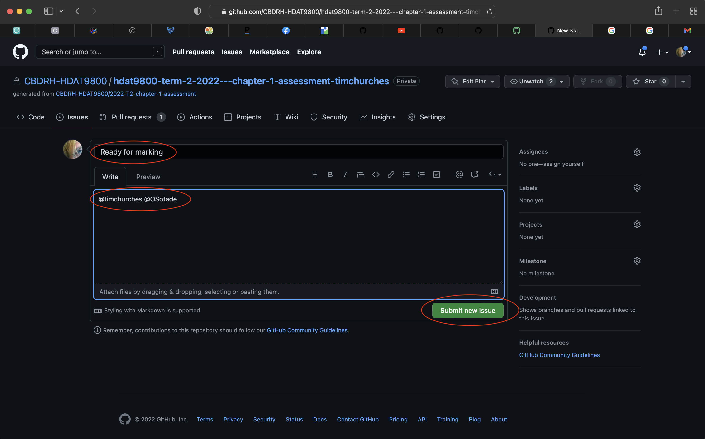
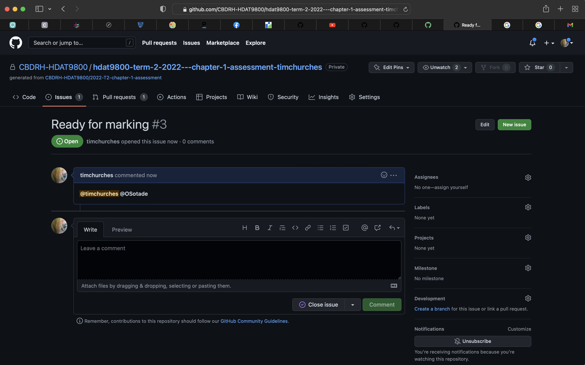
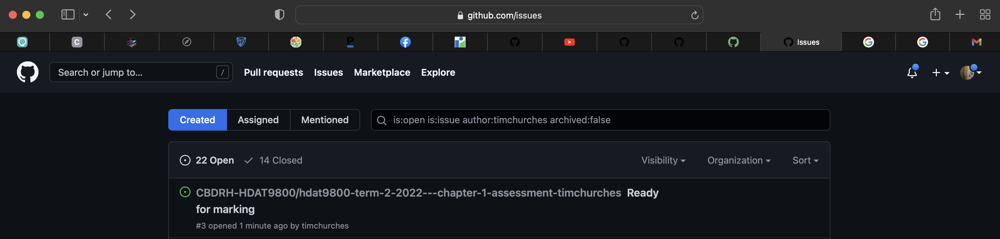

For the Term 2 2022 running of the HDAT9800 course, we are offering early marking of core assignments (those for Chapters 1 to 7). This enables students to work at their own pace through the core curriculum material and the corresponding assessments, potentially leaving more time to work on the two additional assessments, the group assessment and otherwise engage with the additional material offered in each Chapter.

If you have completed a chapter assessment and submitted a final version of your solution to git, and pushed that to your assessment repo on GitHub (the repo that was automatically created for you when you clicked on the assignment link), then you can request early marking (before the assessment due date) by carrying out the steps listed below (it only takes a few seconds).

**Note:** Requesting early marking is optional, and if you don't request it, we will mark your asessments anyway, but not until after the due date for each assessment.

1. In your web browser, go to the repository for the assignment (GitHub will have sent you an email with a link to it, but it will also show up in your list of repositories if you log in to GitHub).

2. Click on the Issues tab (highlighted in red in example screenshot below)

3. You should be at the issue page for the repo. Click on the **New Issue** button.

4. This will open a new issue form. Fill it out as shown below in the red highlighted ovals, with "Ready for marking" as the issue title, and `@timchurches @OSotade` as the body of the issue (that will make it show up in the course instructors open issues lists, see below). When you have filled those in, click the **Submit new issue** button as highlighted below.

5. You should see an open issue for your assessment repository that looks like the screenshot below. That's all you need to do!

The issue you just opened will show up in the open issues list in GitHub for the course instructors (see below for an example). When your assessment has been marked, the instructors will close the issue with a comment that the assessment has been marked. You should receive an email notification about that automatically from GitHub.

This workflow is exactly what you would use if working with collaborators via git and GitHub -- for example, on your group Assessment for this course!

**Note:** Please don't share your marks or comments on your marked assignment with fellow students until **after** the submission deadline for that assessment.
